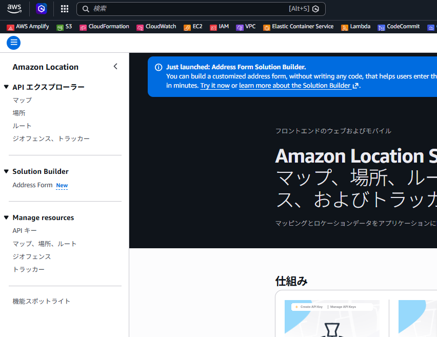
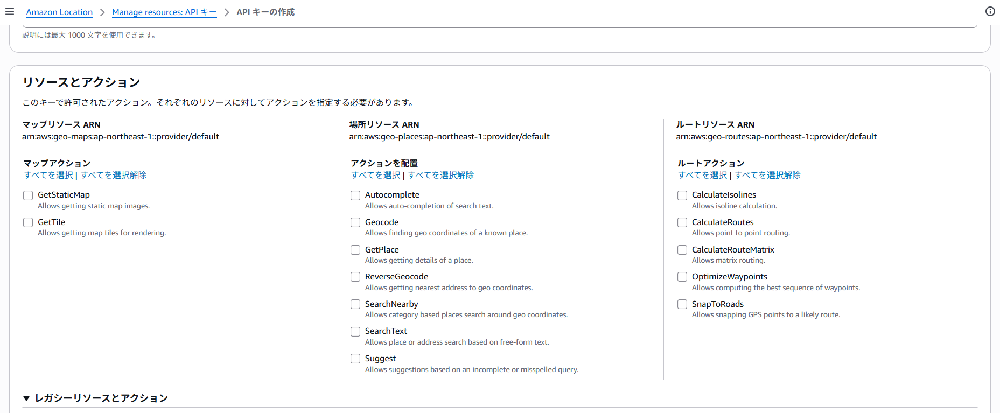

# 目次

- [ASLとは](#bashscript)

# Amazon Location Service

AWSに統合された位置情報気泡を提供するサービス
⇒Google MapのGoogle Map APIのAWS版

以下の技術がすぐに導入可能
ジオコーディング：住所や地名などの情報から緯度経度の地理座標に変換する技術
ジオフェンシング：GPSやWi-Fiなどの位置情報技術を用いて、特定のエリアへの出入りや滞在を検知し自動的に通知などのアクションを行う技術
ルート検索

# 主な機能

## Maps

- 位置情報の視覚化
- オープンデータマップから取得されたマップを提供

## Places

- 検索機能をアプリケーションに統合
- ジオコーディングなど

# マネジメントコンソールより確認

「APIエクスプローラー」下は、各サービスを試しに使用できるもの  
「Solution Builder」はよくあるユースケースをすぐに試せるサービス  
「Manage resources」で、実際に使用する際のリソースを作成していく  

# 認証方法

まずは、サービスを使用する上で認証方法について理解する。  

AWSドキュメント：[https://docs.aws.amazon.com/ja_jp/location/latest/developerguide/access.html](https://docs.aws.amazon.com/ja_jp/location/latest/developerguide/access.html)  

ALSを使用する上で、認証機能として使用できるAWSサービスはAPIキー、Amazon Cognito、IAMの3つ。  

- シンプルに使用したい場合⇒APIキー
- ユーザーごとに認証や制御したい⇒Cognito
- バックエンド（Lambdaなど）から呼び出す⇒IAM

らしいけど重要なのは、***認証方法によって使用できるサービスが異なる***  
***シンプルに使用できるAPIキーでは、できることが限られている***

何が使用できて何が使用できないのか、わかりやすくまとまっているものはない。  
以下、ChatGPTに聞いてみた結果。  

| APIカテゴリ             | APIキー | Cognito | IAM |
| ------------------- | ----- | ------- | --- |
| Maps（地図表示）          | ○     | ○       | ○   |
| Places（検索・GetPlace） | ○     | ○       | ○   |
| Routes（ルート計算）       | ○     | ○       | ○   |
| Tracker（位置更新）       | ❌     | ○       | ○   |
| Geofence（登録・更新）     | ❌     | ○       | ○   |
| リソース作成（Index作成など）   | ❌     | ❌       | ○   |

あとは、APIキー作成画面で、選択できるAPIが表示される。  

# Maps 

APIキーを使用する場合、すべて使用できる  
- GetStaticMap⇒静的マップ
- GetTiles⇒動的マップ

静的マップは、ただの画像  
Google Mapのように使用したい場合は、動的マップを使用する  

メールや資料などに添付する分には、静的マップでよい  
アプリで使用するには動的マップになる。  

## 静的マップの動作確認

- APIキーの作成  
  マネジメントコンソールからAPIキーの作成を行う  
  マップアクションはGetStaticMapのみを選択

- マップの作成  
  マネジメントコンソールからマップの作成を行う  
  - 名前：任意
  - マップ：  
    以下プロバイダー、属性、タイプはその下の選択肢の「Mapスタイル」の選択肢が増えるだけ。なので、全選択状態でよいと思う。  
    特徴毎にフィルタリングして使用する  
    - プロバイダー：HERE、Esri、Open Dataの3つの選択可能  
      ⇒地図データを提供している会社を選択  
      ⇒詳細は[データプロバイダーの違い](#データプロバイダーの違い)を参照   
    - 属性：以下の選択が可能  
      - Satellite：衛生画像
      - Light：明るい配色
      - Dark：黒ベース
      - 3D：立体的に表示
      - Truck：トラック向けの地図
      - Political view：国境、領土の表示が地域ごとに代わる。政治的利用
    - タイプ：以下の選択が可能  
      - Vector：データとして描画する地図、キレイだけと重い
      - Raster：画像として表示する地図、荒いけど軽い  
  - ポリティカルビュー  
    国や地域ごとの「国境・領土の表示ルール」を切り替える設定  
    HEREプロバイダーが特に対応しており、海外向けの場合に使用できる  
  - APIキー  
    今回はAPIキーを認証に使用しているため、作成したAPIキーを選択  

- マップ作成後、作成したマップを選択して、埋め込みマップのタブを選択
  その後、サンプルのHTMLが表示されるため、これをコピーして実行すると、Mapが表示される。  
    

### データプロバイダーの違い

AWSドキュメントには記載がないため、以下ChatGPTに確認  

| 項目     | HERE              | Esri     | Open Data                |
| ------ | ----------------- | -------- | ------------------------ |
| 提供元    | HERE Technologies | Esri     | オープンソース（主にOpenStreetMap） |
| コスト    | 有料                | 有料       | **無料（多くの場合）**            |
| 商用利用   | 可能（制約あり）          | 可能（制約あり） | **比較的自由**                |
| 地図の見た目 | 一般的・高品質           | GIS寄り    | シンプル                     |
| データ精度  | 高い                | 高い       | 地域差あり                    |
| 住所検索   | 強い                | 強い       | やや弱い                     |
| ルート検索  | 強い                | 普通       | 弱い / 制限あり                |
| 更新頻度   | 高い                | 高い       | コミュニティ依存                 |
| 利用制限   | 厳しめ               | 厳しめ      | 緩い                       |

実際には、見た目などで使用しやすいものを選択すると思われる。  