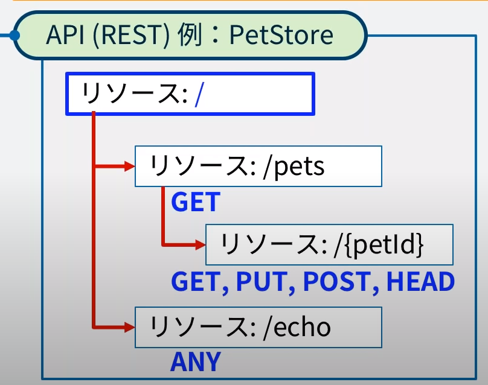
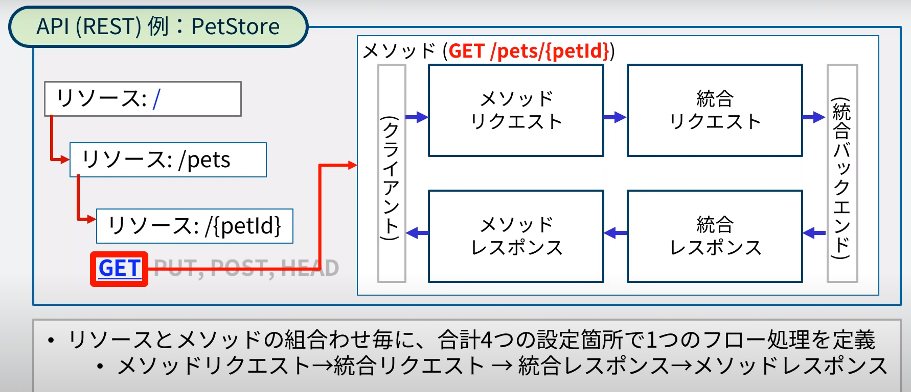

### API Gatewayとは  
APIの作成及び管理を簡単に行える、フルマネージドサービスである。  

### API Gatewayを使いたい理由  

AWSには様々なWeb APIを提供するサービスがある。
- lambda
- S3
- EC2など

 Web APIを公開するのには課題がある  

1. インフラの管理  
（可用性とスケーラビリティ）  
WebAPIを公開するためには、公開するためのサーバーを用意し、それらを管理しないといけない  
自前のサーバを管理するということは  
そのサーバの可用性（システムが継続して稼働できる度合い）やスケーラビリティ（拡張性）を  
考慮しないといけない  
また、公開するAPIをセキュリティ面での攻撃から守らないといけなく  
それらを対応しようとするとコストがかなり掛かってしまう  

2. APIの管理  
（設定やデプロイ制御）
WebAPIは以下のように進展してきた
RPC→SOAP→REST→GraphQL→gRPC [詳しくはこちら](./WebAPIの歴史.md)  
WebAPIの仕様が変われば当然直さないといけなくなる。（バージョン管理）  
また、使用状況のモニタリングも必要。  

3. 認証と認可  
（アクセスの制御）  
誰からどこからでも千知族出来ていいわけではないため、制御が必要  

4. 流量制御と保護  
不特定多数のクライアントから接続がある場合、スロットリング制御が必要  
スロットリング：一定の制限値を超えた場合に意図的に性能を低下させ、要求を一時的に拒否したり制御すること。  

### API Gatewayが扱うAPI  

1. REST  
  - REST = Representational state transfer(表現状態の転送)  
  - Webサービスを開発するときのソフトウェアアーキテクチャーの設計方針  
  - 扱う情報をリソースと定義。HTTPのPUTやGETのメソッドを動詞とみたてて操作  

2. WebSocket  
  - ブラウザなどのクライアントとサーバ間の双方向通信を長時間保持されたTCP接続の上で提供するリアルタイムな通信プロトコル  

### RESTエンドポイントタイプ  

- エッジ最適化  
  一番近い場所を使う（エッジロケーション）  
- リージョン  
  指定したリージョンを使う  
- プライベート  
  インターネットからのアクセスはできずに、プライベートリンクで作成したVPCエンドポイントからの接続のみを許可  

### API設定 デプロイとステージ  

APIの作成や更新を行った後、クライアントからの呼び出しできる状態にするには  
1つのStageを指定して、デプロイという操作が必要。  

Stage：そのAPIが動作する個別の環境セットを意味している。  
→Stageを使って、デプロイを行う  

### REST API  

設定上の構成要素を「リソース」という。  
REST APIのデプロイ以前で設定されたエンドポイント（https://<api-id>.execute-api.<region-id>.amazon.com/<stage-name>/...）
エンドポイントの一番後ろの/と下図の最上位のリソース/が一致する  

### API設定（REST）- メソッド設定  
バックエンドまでの処理フローを定義する  

- メソッドリクエスト  
  何を定義するのか  
  - 認証の設定や入力パラメータの検証に関する設定

- 統合リクエスト  
  - バックエンドとしてどこにどの様にデスパッチするかを指定  
  - バックエンドには5つの種類が用意されている(統合タイプ・・・バックエンドが何かを選択)  
    - Lambda関数  
    - HTTP：バックエンドにHTTPでアクセスするもの  
      EC2でもインターネット上のものでもOK  
    - Mock:マッピングテンプレートを使用して固定的なものを返答する  
    - AWSサービス  
      Kinesis Date Streamとか
    - VPCリンク  
      事前にVPCリンクを作成（これはNLB参照している）し、特定のリソースにアクセスする  

- 統合レスポンス  
  - バックエンドから返されたデータをどのようなデータに加工してAPIGatewayのレスポンスとして返すかの変換を設定する  
  - 変換しないという設定もできる（コンソール上はグレーアウトになる）  

- メソッドレスポンス  
  - HTTPのステータスコードに応じてデータを置き換えて返したい場合に設定  

### API設定 - 認証・認可  

REST APIの場合はメソッドリクエストで、「認証」の設定を行う  
認証方式には3つある。  

1. IAMアクセス権限  
  AWS APiの呼び出し方式で基本となるAWSの署名シグネチャーバージョン4(sigv4)を要求  

2. Lambdaオーソライザー  
  APi開発者に認証方式が委ねられる方式  
  認証処理を行って成功の場合に、IAM　Policy Documentを返すという仕様を実装したLambda関数を指定  
  
3. Cognitoオーソライザー  
  ユーザープールで認証されたトークンを利用して行う方式  

