# CloudFormation 変数セット

### 目次

[変更セットとは](#変数セットとは)  
[やってみよう](#やってみよう)  
[サブネットの作成](#サブネットの作成)  
[サブネットに名前を付ける](#サブネットに名前を付ける)  
[変更セットの削除](#変更セットの削除)  


### 変数セットとは
スタック実行前に事前に変更箇所を確認できる機能
⇒意図せずリソースが削除されるのを防ぐ

直接更新と言って、スタックを何もせずすぐに更新できるが  
更新後リソースが「DELETE COMPLETE」で削除されると、元に戻せないため  
本番環境で運用しているAWSアカウントなどには必須となる項目  

### やってみよう

参考文献：[CloudFormationの変更セットってなんだろ？](https://zenn.dev/mn87/articles/e5cbf848a97bb9)  

今回使うテンプレートはVPCを定義したものとなります。  
[こちら](./test.yml)  

1. CloudFormationサービスからスタックの作成を行う

2. [test.yml](./test.yml)をアップロードして次へ


3. スタック名を「vpc-sample」にして次へ


4. スタックオプションはデフォルトのまま次へ

5. 左下の変更セットを作成を選択し、デフォルトのまま「変更セットを作成」をクリック
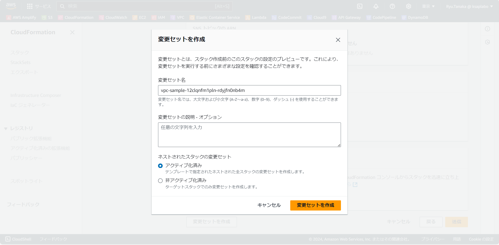

6. 変更セットの画面へ移行する
  右上の更新ボタンを押すと、変更内容が表示され、Addに表示されているものは今回追加するリソースとなる  
  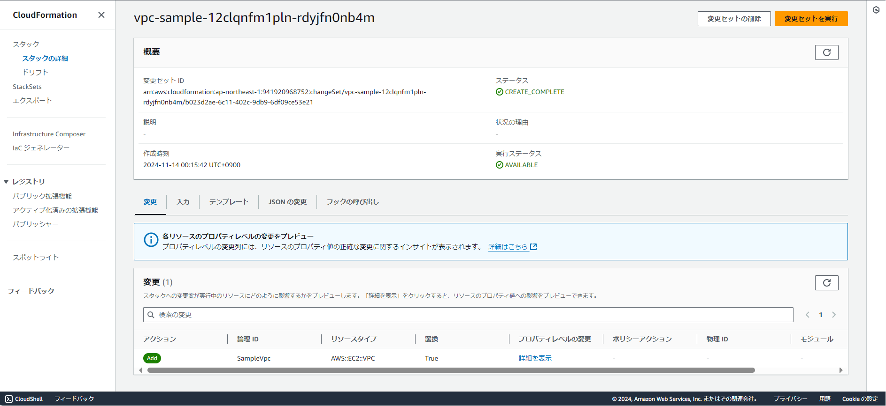

7. 「変更セットを実行」をクリックするとオプションを聞かれるので、そのまま実行
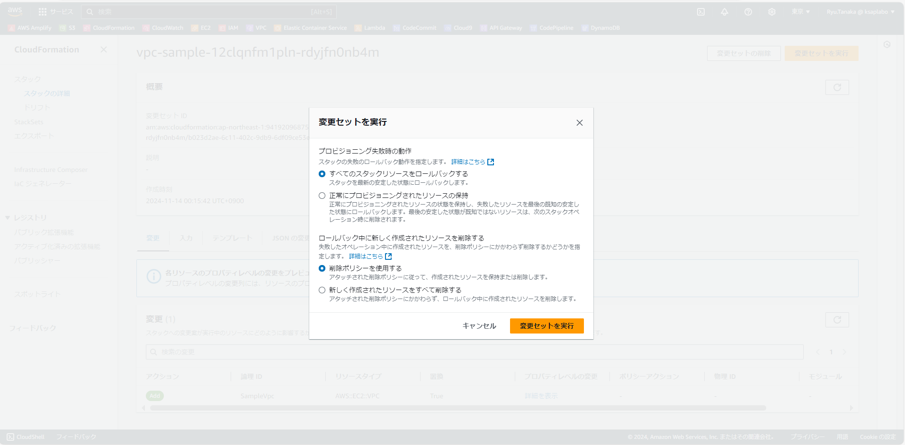

8. スタックの画面に戻り、スタックが作成される
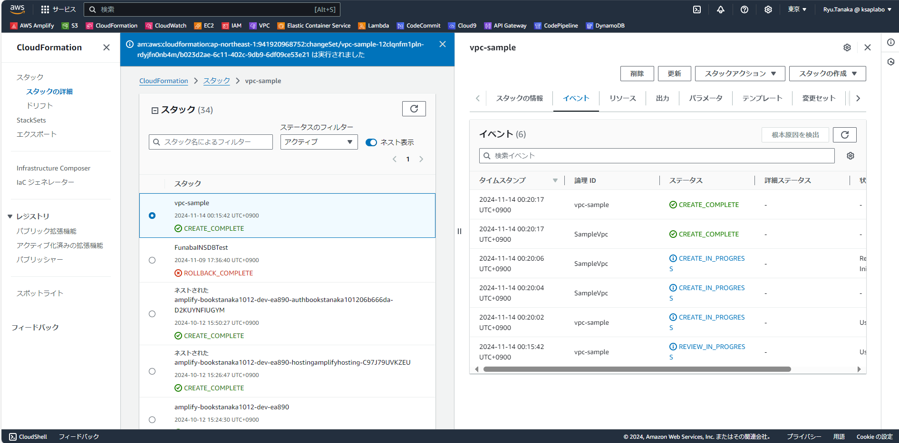

VPCが作成されていることを確認。  
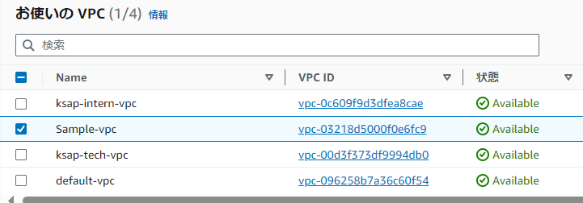


### サブネットの作成

作成したSample-vpcにサブネットを2つ追加します。  
使用するテンプレートは[こちら](./test2.yml)  

CloudFormationのコンソールで先ほど作成したスタックを選択して、スタックアクションから既存スタックの変更セットを作成をクリックします。  
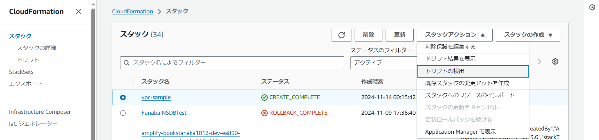

既存テンプレートを置き換えるを選択して新しいテンプレートファイルをアップロードし、次へ  
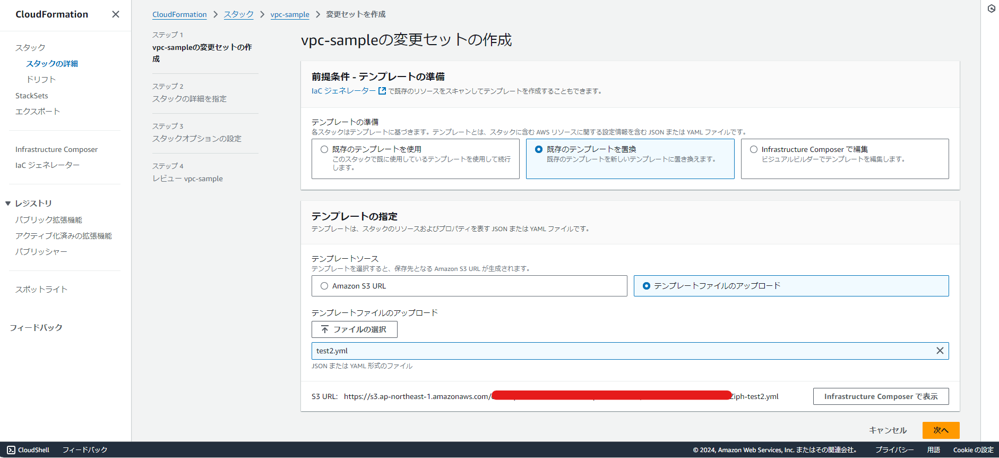

変更セット名はデフォルトのまま、次へ  
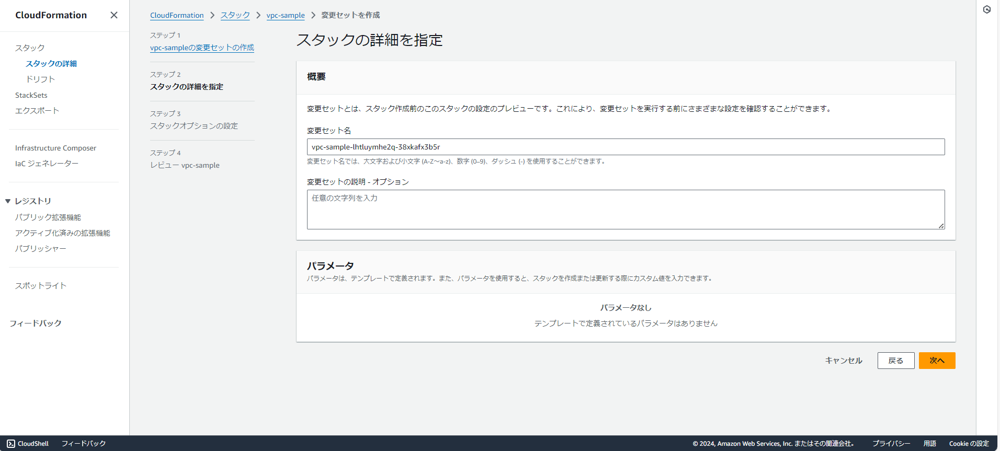

スタックオプションはデフォルトのまま、変更セットの作成を行う  
SubnetがAddされることがわかる。  
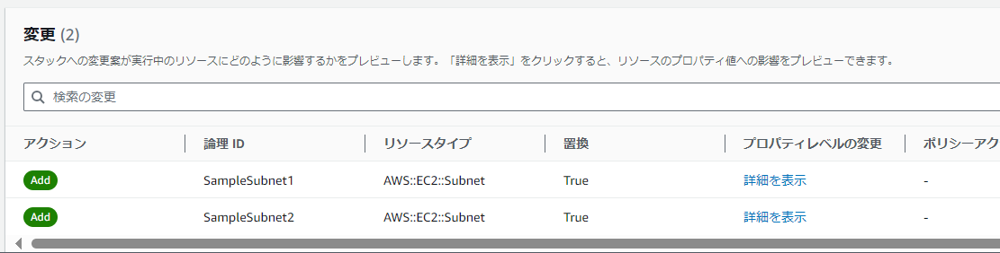

このまま、変更セットを実行すると、VPCにサブネットが2つ作成される。  


### サブネットに名前を付ける

更新時はどうなるかを確認するために、サブネットに名前を追加してみます。  
使用するテンプレートは[こちら](./test3.yml)  

手順は先ほどと変わらないので省略。  
変更アクションには、先ほどはAddだったが、今回は変更のためModifyと表示される  
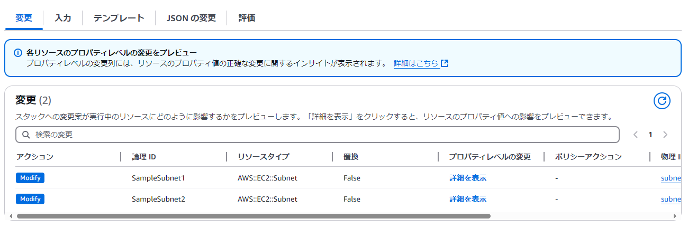

JSONの変更タブからさらに詳細を確認できる  
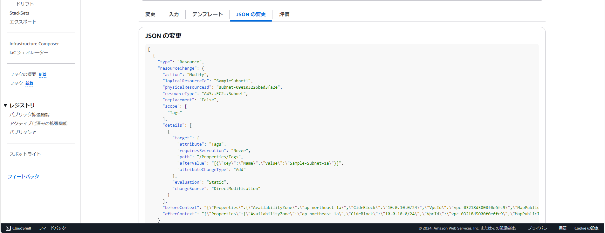

以下抜粋した内容  
```json
{
  "type": "Resource",
  "resourceChange": {
    "action": "Modify",
    "logicalResourceId": "SampleSubnet1",
    "physicalResourceId": "subnet-09e103226bed3fa2e",
    "resourceType": "AWS::EC2::Subnet",
    "replacement": "False",
    "scope": [
      "Tags"
    ],
    "details": [
      {
        "target": {
          "attribute": "Tags",
          "requiresRecreation": "Never",
          "path": "/Properties/Tags",
          "afterValue": "[{\"Key\":\"Name\",\"Value\":\"Sample-Subnet-1a\"}]",
          "attributeChangeType": "Add"
        },
        "evaluation": "Static",
        "changeSource": "DirectModification"
      }
    ],
    "beforeContext": "{\"Properties\":{\"AvailabilityZone\":\"ap-northeast-1a\",\"CidrBlock\":\"10.0.10.0/24\",\"VpcId\":\"vpc-03218d5000f0e6fc9\",\"MapPublicIpOnLaunch\":\"false\"}}",
    "afterContext": "{\"Properties\":{\"AvailabilityZone\":\"ap-northeast-1a\",\"CidrBlock\":\"10.0.10.0/24\",\"VpcId\":\"vpc-03218d5000f0e6fc9\",\"MapPublicIpOnLaunch\":\"false\",\"Tags\":[{\"Value\":\"Sample-Subnet-1a\",\"Key\":\"Name\"}]}}"
  }
},
```
resourceChangeが1つのリソース単位  
detailsが変更内容の詳細  

### 変更セットの削除

テンプレートからサブネットを１つ消して、変更セットを作成する（テンプレートと手順も省略）  
変更セットのアクションには「Remove」画表示される  
Cfnを使用する上でこのRemoveが表示されたときは特に注意が必要（そのための変更セットである。）  

