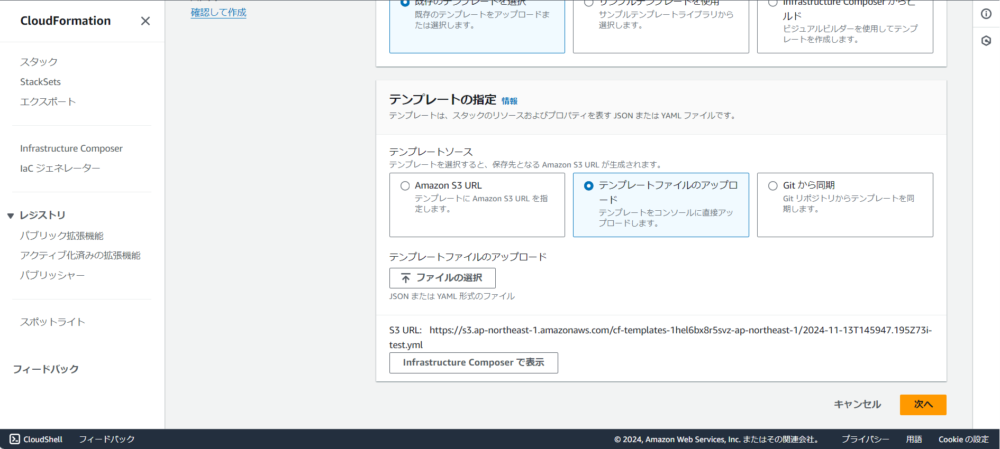

# CloudFormation 変数セット

### 目次

### 変数セットとは
スタック実行前に事前に変更箇所を確認できる機能
⇒意図せずリソースが削除されるのを防ぐ

直接更新と言って、スタックを何もせずすぐに更新できるが  
更新後リソースが「DELETE COMPLETE」で削除されると、元に戻せないため  
本番環境で運用しているAWSアカウントなどには必須となる項目  

### やってみよう

参考文献：[CloudFormationの変更セットってなんだろ？](https://zenn.dev/mn87/articles/e5cbf848a97bb9)  

今回使うテンプレートはVPCを定義したものとなります。  
[こちら](./test.yml)  

1. CloudFormationサービスからスタックの作成を行う

2. [test.yml](./test.yml)をアップロードして次へ

3. スタック名を「vpc-sample」にして次へ
