# Cloud Formation  

## 目次  
1. [Try1 S3で静的サイトのデプロイ](#content1)  
2. [Try2 S3のデプロイ](content2)  
3. [S3のテンプレート情報](content3)  

<h2 id="content1">Try1 S3で静的サイトのデプロイ</h2>  

参考サイト：https://qiita.com/YoshinagaYuta/items/26d2843fa9a8dfda5240#cloudformation%E5%AE%9F%E7%94%A8%E4%BE%8B  

参考サイトを元に以下の構成を作成する  
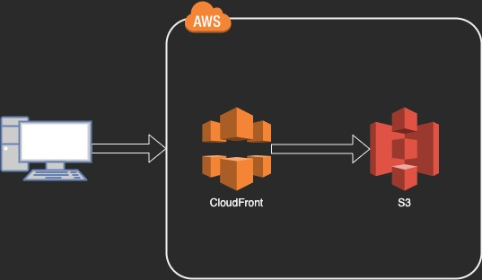  

- S3で静的サイトを公開  
- S3はパブリックリードを全てブロックして。CloudFrontのOAI経由飲みでアクセスできるようにする  
- S3のパケットポリシーとCloudFrontOriginAccessIdentityも一緒に作成  

CloudFormationのコード  
```yaml
AWSTemplateFormatVersion: 2010-09-09

Parameters:
  BucketName:
    Type: String

Resources:
  S3Bucket:
    Type: AWS::S3::Bucket
    Properties:
      AccessControl: LogDeliveryWrite
      BucketName: !Ref BucketName
      WebsiteConfiguration:
        IndexDocument: "index.html"
        ErrorDocument: "error.html"
      PublicAccessBlockConfiguration:
        BlockPublicAcls: TRUE
        BlockPublicPolicy: TRUE
        IgnorePublicAcls: TRUE
        RestrictPublicBuckets: TRUE

  S3BucketPolicy:
    Type: AWS::S3::BucketPolicy
    DependsOn:
      - S3Bucket
      - CloudFrontOriginAccessIdentity
    Properties:
      Bucket: !Ref S3Bucket
      PolicyDocument:
        Version: 2008-10-17
        Statement:
          - Action:
              - s3:GetObject
            Effect: Allow
            Resource: !Sub "${S3Bucket.Arn}/*"
            Principal:
              AWS: !Sub "arn:aws:iam::cloudfront:user/CloudFront Origin Access Identity ${CloudFrontOriginAccessIdentity}"

  CloudFrontOriginAccessIdentity:
    Type: AWS::CloudFront::CloudFrontOriginAccessIdentity
    Properties:
      CloudFrontOriginAccessIdentityConfig:
        Comment: "access identity"

  CloudFrontDistribution:
    Type: AWS::CloudFront::Distribution
    DependsOn:
      - S3Bucket
      - CloudFrontOriginAccessIdentity
    Properties:
      DistributionConfig:
        Enabled: true
        DefaultCacheBehavior:
          AllowedMethods:
            - HEAD
            - GET
            - OPTIONS
            - PUT
            - POST
            - PATCH
            - DELETE
          CachedMethods:
            - HEAD
            - GET
          DefaultTTL: 3600
          MaxTTL: 86400
          MinTTL: 0
          TargetOriginId: !Sub "${BucketName}-Origin"
          ViewerProtocolPolicy: https-only
          ForwardedValues:
            QueryString: false
        IPV6Enabled: false
        HttpVersion: http2
        DefaultRootObject: index.html
        ViewerCertificate:
          CloudFrontDefaultCertificate: true
        Origins:
          - Id: !Sub "${BucketName}-Origin"
            DomainName: !Sub "${BucketName}.s3.${AWS::Region}.amazonaws.com"
            S3OriginConfig:
              OriginAccessIdentity: !Sub "origin-access-identity/cloudfront/${CloudFrontOriginAccessIdentity}"
        CustomErrorResponses:
          - ErrorCachingMinTTL: 0
            ErrorCode: 403
            ResponseCode: 404
            ResponsePagePath: "/error.html"
          - ErrorCachingMinTTL: 0
            ErrorCode: 404
            ResponseCode: 404
            ResponsePagePath: "/error.html"
          - ErrorCachingMinTTL: 0
            ErrorCode: 500
            ResponseCode: 500
            ResponsePagePath: "/error.html"
```

## Cloud Formationの実行手順  

1. リージョンはap-northeast-1(東京)を選択しておく。  
2. CloudFormationのコンソール画面を開き、スタックの作成＞新しいリソースを使用（標準）を選択  
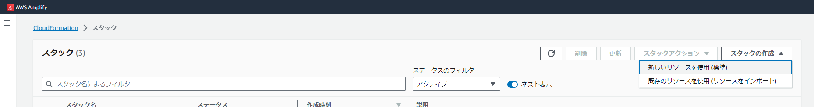  

3. テンプレートの指定でローカルのテンプレート([practice1.yml](./template/practice1.yml))をアップロードし、次へ  
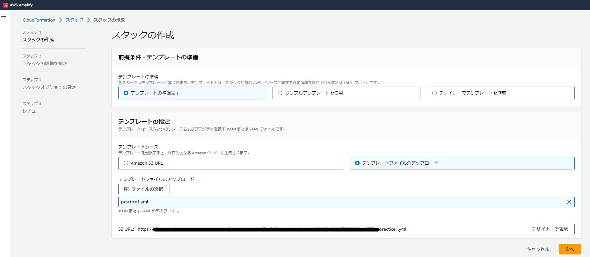  

4. スタックの名前、パラメータを入力し次へ  
  - スタック名：Practice1Stack
  - パラメータ：BucketName→Practice1Backet  
  (パラメータはpractice1.ymlの3~5行目に定義されている)  
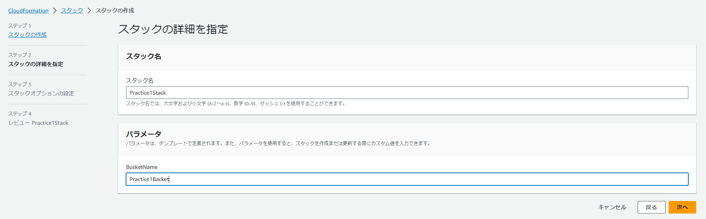  

5. スタックのオプションはそのままで次へ  

6. 確認画面から送信を押すと、デプロイが始まる  
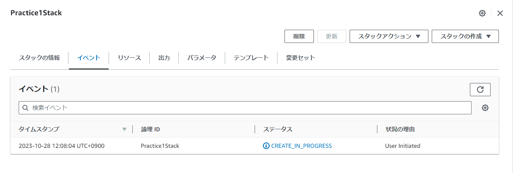  

7. めっちゃエラーが出た  
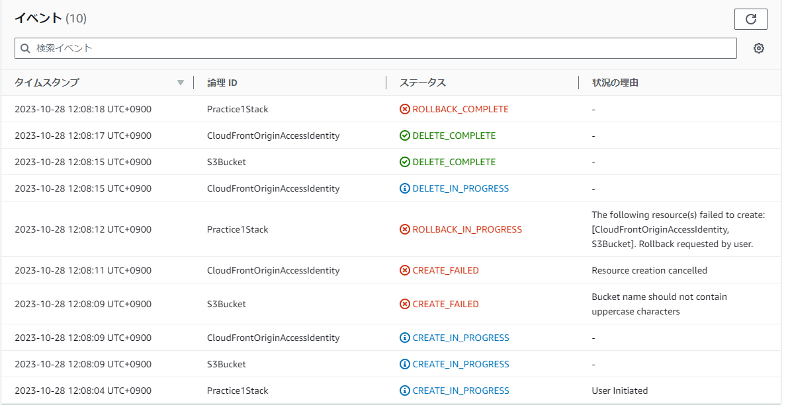  

原因を調査していく  
**#1 S3Backet Create_Failed Bucket name should not contain uppercase characters**  
バケット名の命名規則でこけたっぽい  
バケット名規則：https://docs.aws.amazon.com/ja_jp/AmazonS3/latest/userguide/bucketnamingrules.html  
→大文字を入れれない  
とりあえず、パラメータを修正し、再実行  

8. 編集を行うためには変更セットから、変更セットの作成を選択する。  
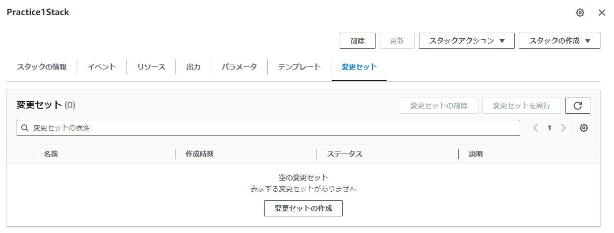  

9. バケット名をpractice1backetに変更し、送信  

10. 原因不明のエラー  
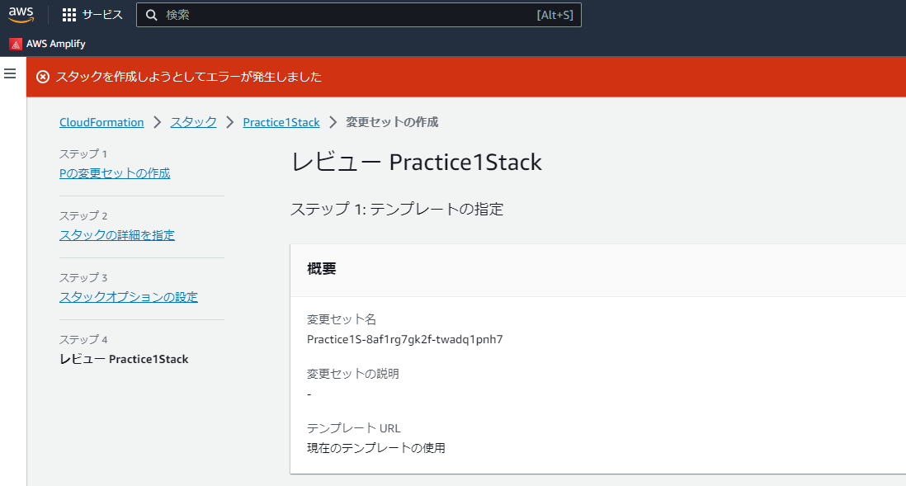  
エラー原因が見当たらないので有識者に聞くことにする。。。  

11. スタックを１から作り直したが、またエラーが出る。  
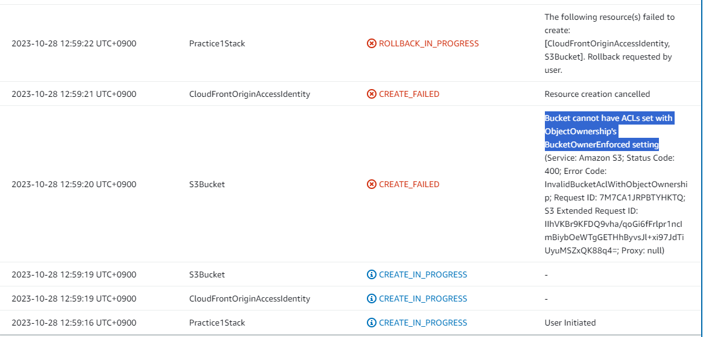  
そもそも参考にしていたサイトが3年前以上のものだったので、別のものを参考にしてみた。  

<h2 id="content2">Try2 S3のデプロイ</h2>  

参考サイト：https://www.youtube.com/watch?v=Na9Wl4Flr8M  
（この動画も古いが、デプロイ内容がシンプルであったためTryしてみる。）  

1. yamlを用意する([practice2.yml](./template/practice2.yml))  
```yaml
Resources:
  FirstS3Bucket:
    Type: "AWS::S3::Bucket"
    Properties: {}
```

2. 先ほどと同様の手順でデプロイまで進める  
   →成功  
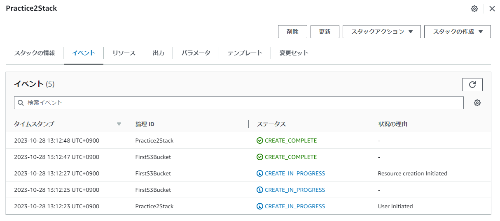  
S3バケットが作成されていることがわかる  
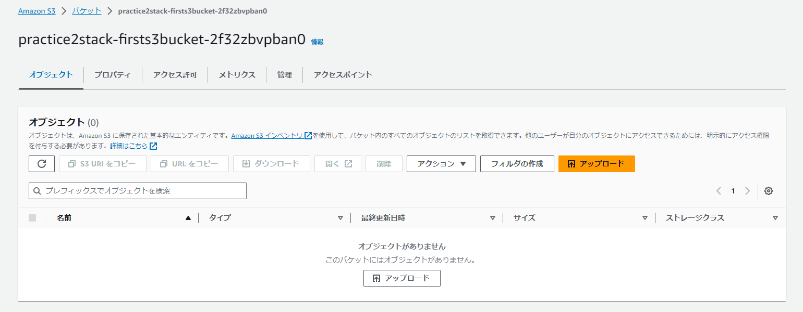 

<h2 id="content3">S3のテンプレート情報</h2>  

CloudFormationのテンプレートを作成するときは  
1から自分の手でテンプレートを作成するより、ネット上に数万とあるテンプレートを使用したほうがいいが  
大事なのは、拾ってきたテンプレートを自分の使いたいように編集できること。  
(テンプレートの理解が大事)  

CloudFormationでデプロイするテンプレートは以下のサイトにある  
https://docs.aws.amazon.com/ja_jp/AWSCloudFormation/latest/UserGuide/quickref-s3.html  

S3テンプレートのパラメータについては以下のサイトにある  
https://docs.aws.amazon.com/AWSCloudFormation/latest/UserGuide/aws-resource-s3-bucket.html  


<h2 id="content4">S3の静的サイトの公開</h2>  

静的サイトをS3で作成するテンプレートを作成する。  
一旦コンソール画面からの作成を行ってみる→[静的ウェブサイトの設定](Static%20website%20settings.md)  

テンプレートはAWSのスニペットを使用  
https://docs.aws.amazon.com/ja_jp/AWSCloudFormation/latest/UserGuide/quickref-s3.html  

templateのyamlは以下  
```yaml
AWSTemplateFormatVersion: 2010-09-09
Resources:
  S3Bucket:
    Type: 'AWS::S3::Bucket'
    Properties:
      AccessControl: PublicRead
      WebsiteConfiguration:
        IndexDocument: index.html
        ErrorDocument: error.html
    DeletionPolicy: Retain
    UpdateReplacePolicy: Retain
  BucketPolicy:
    Type: 'AWS::S3::BucketPolicy'
    Properties:
      PolicyDocument:
        Id: MyPolicy
        Version: 2012-10-17
        Statement:
          - Sid: PublicReadForGetBucketObjects
            Effect: Allow
            Principal: '*'
            Action: 's3:GetObject'
            Resource: !Join 
              - ''
              - - 'arn:aws:s3:::'
                - !Ref S3Bucket
                - /*
      Bucket: !Ref S3Bucket
Outputs:
  WebsiteURL:
    Value: !GetAtt 
      - S3Bucket
      - WebsiteURL
    Description: URL for website hosted on S3
  S3BucketSecureURL:
    Value: !Join 
      - ''
      - - 'https://'
        - !GetAtt 
          - S3Bucket
          - DomainName
    Description: Name of S3 bucket to hold website content
```
テンプレートの設定内容を読み解いていく  
```yaml
  S3Bucket:
    Type: 'AWS::S3::Bucket'
    Properties:
      AccessControl: PublicRead
      WebsiteConfiguration:
        IndexDocument: index.html
        ErrorDocument: error.html
    DeletionPolicy: Retain
    UpdateReplacePolicy: Retain
```
- AccessControl: PublicRead  
  所有者とグループ？がアクセス可能  
  ACLは無効でいいので、pravateにする  
  ドキュメント：https://docs.aws.amazon.com/AmazonS3/latest/userguide/acl-overview.html#canned-acl  
- WebsiteConfiguration
  静的ウェブサイトホスティングの設定  
  ドキュメント：https://docs.aws.amazon.com/AWSCloudFormation/latest/UserGuide/aws-properties-s3-bucket-websiteconfiguration.html  
- DeletionPolicy  
  スタックが削除されたときの設定  
  Retainはスタックを削除する際に、リソースやコンテンツを削除せず保持する  
  ドキュメント：https://docs.aws.amazon.com/ja_jp/AWSCloudFormation/latest/UserGuide/aws-attribute-deletionpolicy.html
- UpdateReplacePolicy  
  タック更新オペレーションでリソースを置き換えるときに、リソースの既存の物理インスタンスを保持したり、必要に応じてバックアップしたりします  
  Retainは保持する  
  ドキュメント：ドキュメント：https://docs.aws.amazon.com/ja_jp/AWSCloudFormation/latest/UserGuide/aws-attribute-deletionpolicy.html  

```yaml
  BucketPolicy:
    Type: 'AWS::S3::BucketPolicy'
    Properties:
      PolicyDocument:
        Id: MyPolicy
        Version: 2012-10-17
        Statement:
          - Sid: PublicReadForGetBucketObjects
            Effect: Allow
            Principal: '*'
            Action: 's3:GetObject'
            Resource: !Join 
              - ''
              - - 'arn:aws:s3:::'
                - !Ref S3Bucket
                - /*
      Bucket: !Ref S3Bucket
```
これは[Amazon S3 での静的ウェブサイトの設定](./Static%20website%20settings.md)で試したときの  
特定のIPが追加されるように設定

[practice3.yml](./template/practice3.yml)をCloudformationでデプロイ→成功  
あとはindex.htmlをバケットに保存することでOK  

今回したデプロイは、札幌の開発ネットワークからのアクセスのみを許可したS3の静的ウェブサイトをCloudformationで作成した。  

