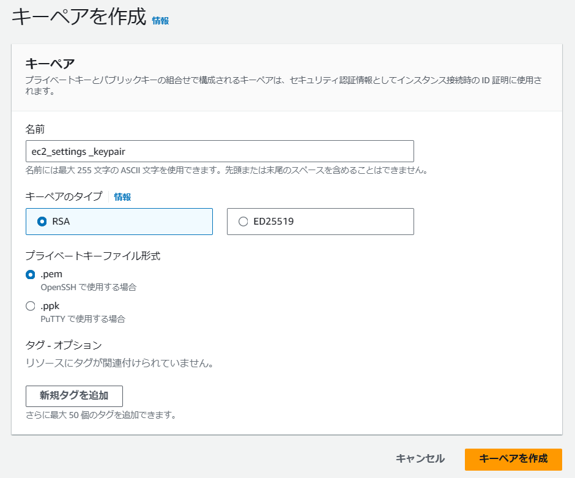
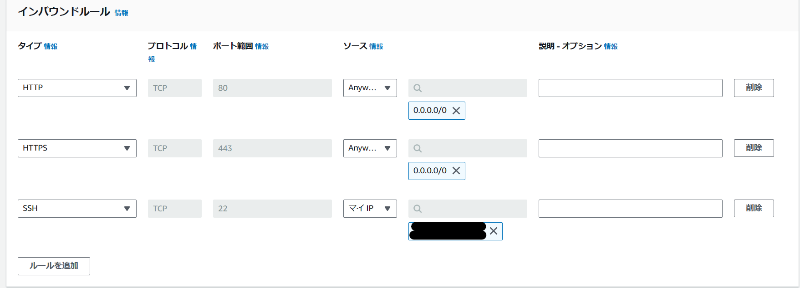

# EC2を立ててみる  

ポータル画面からEC2を起動させることは簡単だが  
一般的な、ベストプラクティス的な構築方法は何かを調べる  
(パブリックIPは公開しないなど)  

[公式ベストプラクティス](https://docs.aws.amazon.com/ja_jp/AWSEC2/latest/UserGuide/ec2-best-practices.html)  
上記のサイトにEC2についてのベストプラクティスが記載されている（がそもそも何をどう設定できるのかわからないため、一旦ポータル画面でから作成してみる）  

## チュートリアル  
参考：https://docs.aws.amazon.com/ja_jp/AWSEC2/latest/UserGuide/EC2_GetStarted.html  

1. キーペアの作成  
   EC2のセットアップ前に、キーペアを作成する。  
   EC2のキーペアとは、EC2に不正アクセスされるリスクを減らすためのもの  
   キーペアを使用することで、外部からアクセスされることのない秘密鍵を保持し、それを使用してEC2インスタンスにログインできる。  
   認証は公開鍵暗号方式を使用。  

   キーペア作成の手順は[こちら](https://docs.aws.amazon.com/ja_jp/AWSEC2/latest/UserGuide/get-set-up-for-amazon-ec2.html)  
     

   ローカルにpemファイルがダウンロードされる。  

2. セキュリティグループの作成  
   EC2のファイアウォール  
   Webサーバであれば、HTTP及びHTTPS通信だけを許可  
   DBであればMySQLの3306ポートのみ許可するなど  

   リージョンはap-northeast-1(東京)で作成（キーペアと同じでないといけない）  
     

3. 
