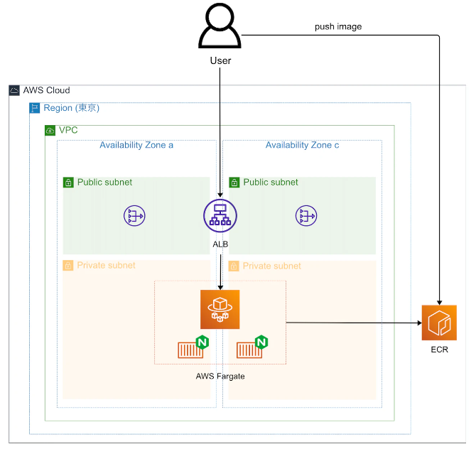

# ECS,Fargate  

現場前研修にベストなサイトを見つけた  
https://qiita.com/K5K/items/2bab270b8fad24505303  

Nginxのサーバをコンテナで立てる  
  

手順は以下の通り  
- NWリソース作成  
- コンテナイメージの作成、ECRへPUSH  
- ALBの作成  
- クラスターの作成  
- タスク定義の作成  
- サービスの作成  

### NWリソース作成  
詳細は[こちら](./makenetwork.md)  

### コンテナイメージの作成、ECRへPush  

※参考手順ではローカル環境でLinuxが使えること、Dockerがあることが前提  
[windowsにWSL2＋Docker環境を構築する手順](https://qiita.com/taka777n/items/ea3a1b3a2802aabf3db2)  
[windowsのwslを有効化せずにwslを入れたときに出るエラー対応](https://qiita.com/miriwo/items/485381cdc2c9b14c9477)  

- ポータル画面からECSの画面を開く  
- サイドメニューのリポジトリを開く  
- Privateリポジトリのまま、リポジトリの作成を押す
- リポジトリ名のところにtest-webと入力し、それ以外はデフォルトのまま作成を行う  

- ローカル環境でDockerImageの作成を行う  

→windowsやAWSのCloudShellからDockerを試そうとしたが、どれもうまくいかず。  
 苦戦中

