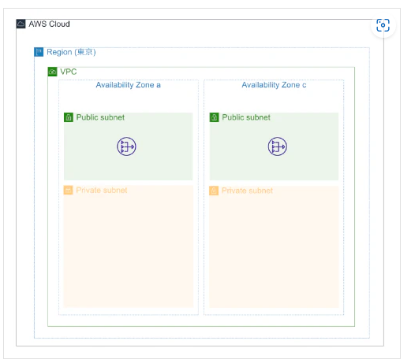

# ECS,Fargate  

現場前研修にベストなサイトを見つけた  
https://qiita.com/K5K/items/2bab270b8fad24505303  

Nginxのサーバをコンテナで立てる  
  

手順は以下の通り  
- NWリソース作成  
- コンテナイメージの作成、ECRへPUSH  
- ALBの作成  
- クラスターの作成  
- タスク定義の作成  
- サービスの作成  

### NWリソース作成  

※手順はないが苦戦中  
以下の環境を作成する  
  

各種機能やパラメータを確認して行っていく  
  

- VPCの作成  
    


- vpc、subnetの作成  

  vpcの設定  
  IP：10.0.0.0/24  

  subnetの設定  
  IP：10.0.0.0/28  
  IP：10.0.0.16/28  

  ※この設定で戸惑ったのでメモ  
```
IPを二進数で表すとわかりやすい
vpc(10.0.0.0/24)
00001010 00000000 00000000 / 00000000

subnet(10.0.0.0/28)
00001010 00000000 00000000 0000/0000
subnet(10.0.0.16/28)
00001010 00000000 00000000 0001/0000
subnet(10.0.0.32/28)
00001010 00000000 00000000 0010/0000
subnet(10.0.0.64/28)
00001010 00000000 00000000 0100/0000
```

- インターネットゲートウェイの作成  

  指定するのは名前のみ  

- vpcにインターネットゲートウェイをアタッチ  
- subnetのルートテーブルに以下を加える  
  送信先：0.0.0.0/0  
  ターゲット：igw-~~~(インターネットゲートウェイのID)  

- private用のサブネットを二つ作成  
- NATゲートウェイの作成  
