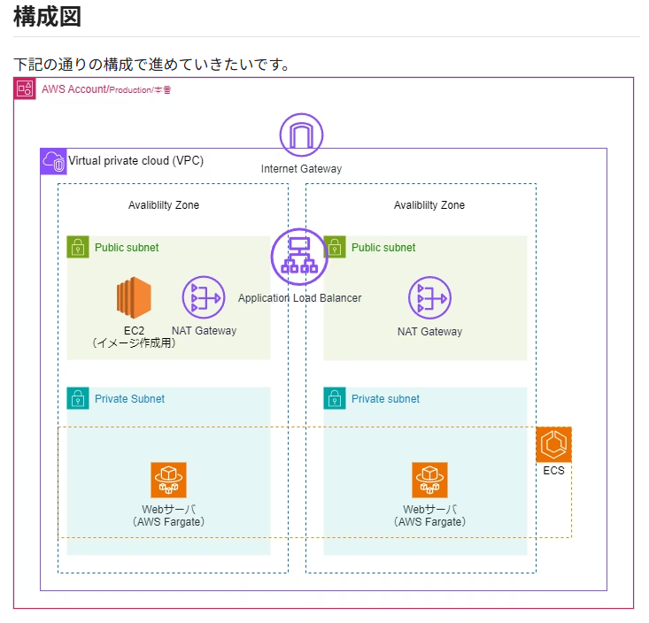
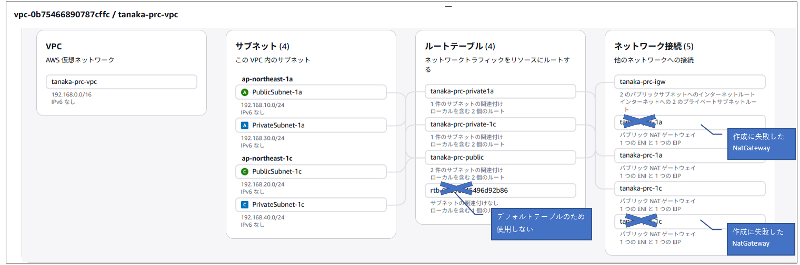

# 目次

# 概要
VPC関連のネットワーク学習のため以下のサイトを参考に実際に環境を作成する。  
参考サイト：[https://qiita.com/AowuShuoji/items/2988f461d25c84177006](https://qiita.com/AowuShuoji/items/2988f461d25c84177006)  


# 構成図  




# VPC、サブネットの作成

## VPCの作成

- IPv4CIDR  
  一般的に以下から選択する。  
  | 範囲          | CIDR | アドレス数  | 規模感  |
  | ----------- | ---- | ------ | ---- |
  | 10.0.0.0    | /8   | 約1677万 | 超大規模 |
  | 172.16.0.0  | /12  | 約104万  | 中規模  |
  | 192.168.0.0 | /16  | 約6.5万  | 小規模  |

  →192.168.0.0/16を使用する


## Subnetの作成

サブネットは、Publicが2つ、Privateが2つの計4つ作成する。  

|Subnet名|IP|
|-|-|
|PublicSubnet-1a|192.168.10.0/24|
|PublicSubnet-1c|192.168.20.0/24|
|PrivateSubnet-1a|192.168.30.0/24|
|PrivateSubnet-1c|192.168.40.0/24|


## NATGateway、InternetGatewayの作成

この後のルートテーブルで使用するため、先に作成する。
IGW→作成だけでは料金はかからない
NATGateway→PrivateSubnetから外に出るために必要

- IGW
  名前だけ指定して作成
  作成後、VPCにアタッチする

- NatGateway
  各PublicSubnetに配置するため、2つ作成。  
  アベイラビリティモードは「ゾーナル」を指定  
  接続対応はパブリック  
  Elastic IPの割り当ては必須  

  →NatGatewayの作成で以下のエラー
  ```
  Network vpc-0b75466890787cffc has no Internet gateway attached
  ```
  先にVPCにIGWをアタッチする必要があった。  

## ルートテーブル

サブネットに付与されるテーブル  
PrivateSubnet→NatGatewayに向かうように  
PublicSubnet→InternetGatewayに向くように  

PrivateSubnetのルートテーブルを2つのPrivateSubnet共有にしてしまうと
- ２つ作成したNatGatewayが意味ない  
- 1a→1cの通信で、割高になってしまう  


-----------------------------------------------

ここまでで作成したリソースのリソースマップは以下のようになる。  


-----------------------------------------------


## セキュリティグループ

EC2用セキュリティグループ（イメージ作成用インスタンス）  
ALB用、コンテナ用それぞれのセキュリティグループを作成  

tanaka-prc-sg-ec2,tanaka-prc-sg-alb,tanaka-prc-sg-ecsを作成  

tanaka-prc-ec2roleのロールも作成  

## EC2からImagePush

- PublicSubnet1aにEC2インスタンスを作成
  (ECRにPushできるようにIAM Roleを作成)
↓
- EC2内からImageをPushする

## ECS

- ECSクラスターの作成
  名前だけ指定して作成  
↓
- タスク定義の作成
  - タスク名は任意
  - タスクサイズは最小のもの
  - タスクロールは、アプリがDynamoDBなどに接続する場合に必要。今回は不要
  - コンテナ名
  - ECRにPushしたイメージを指定（UIで簡単に指定できる）


## まとめ

ここまで学習したリソースをCfnで保存しておく  
[prc-vpc.yml](prc-vpc.yml)