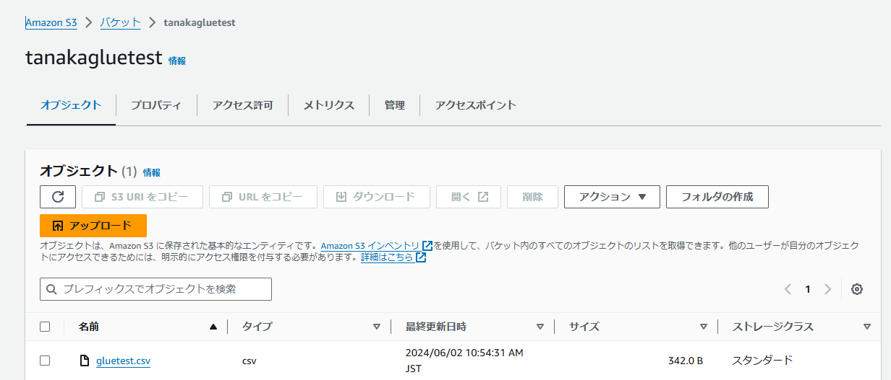
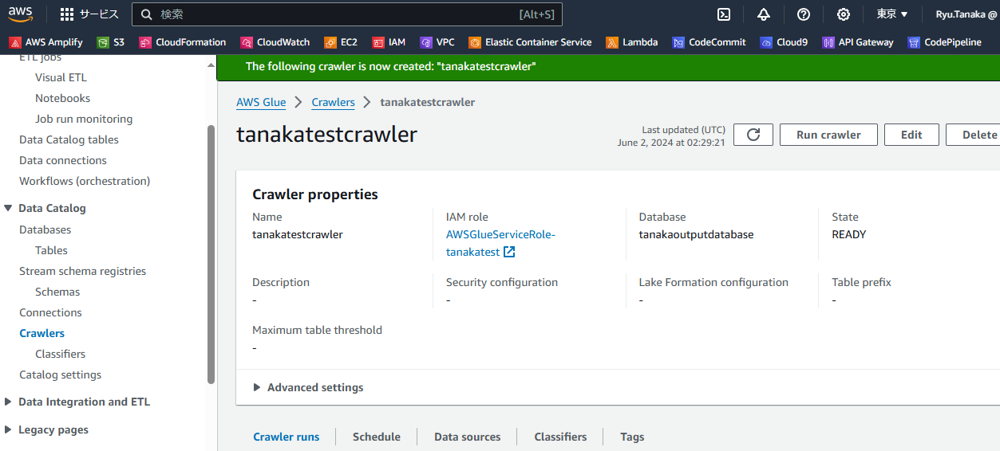
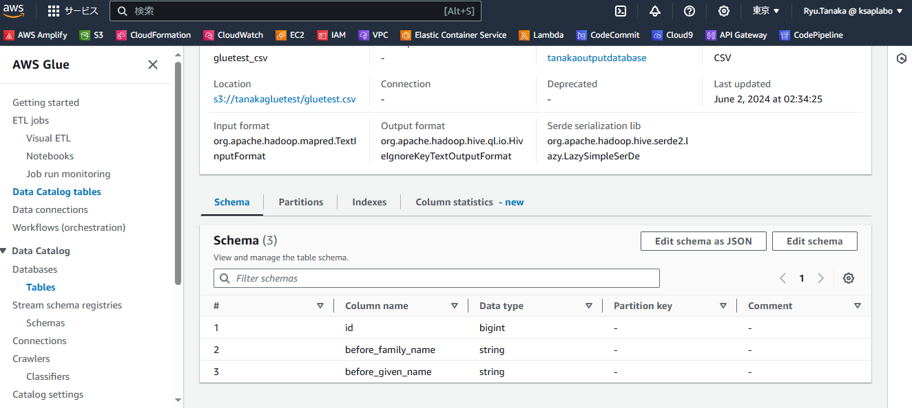
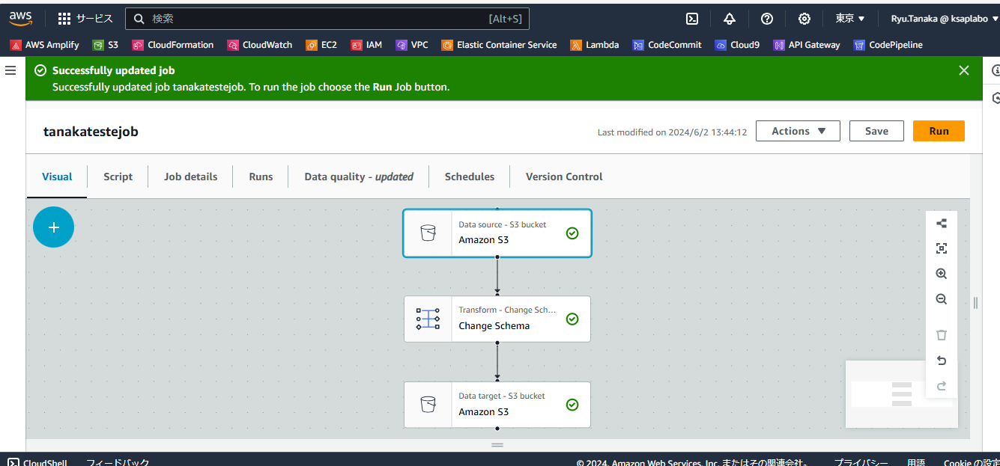

# Glueの基礎  

参考サイトは[こちら](https://www.slideshare.net/slideshow/20190806-aws-black-belt-online-seminar-aws-glue/161761881)（BlackBelt）  

## Glueとは

様々なデータソースのメタデータを管理する  
フルマネージドでサーバレスなETLサービス  

メタデータ：データに付随しているデータ（作成日付や作成者など）  
フルマネージド：インフラストラクチャ管理などを勝手にやってくれること  
ETL：Extract（抽出）、Transform（変換）、Load（書き出し）の頭文字。様々な形式のデータを統一して保存する処理のこと  

## やってみた  

[こちら](https://zenn.dev/hisamitsu/articles/6c233d6d0f0817)のサイトを参考にGlueを使ってみた。  

- 以下のcsvデータ([guletest.csv](./gluetest.csv))を適当なS3バケットに置く    
```
id,before_family_name,before_given_name
1,やまもと,いちろう
2,ささき,じろう
3,こいけ,さぶろう
4,さとう,しろう
5,たなか,ごろう
6,なかむら,ろくろう
7,かとう,しちろう
8,やまだ,はちろう
9,みうら,きゅうろう
10,ふじい,じゅうろう
11,さいとう,じゅういちろう
```



- Glueマネジメントコンソール>Data Catalog>Crawlersからクローラーを新規に作成していく  

- Add Data sourceでS3を選択し、先ほどのcsvのS3パスを入力する。  

- 画面に従いRole,outputのdatabaseも作成

- クローラーの作成が完了  



- Run Crawlerでクローラーを実行する  
  ※Crawler Stopを行わないと、ずっと動き続ける  

- マネジメントコンソールから作成したoutputのデータベースを参照し  
  データベース内のテーブルを見ると、csvのスキーマ情報が登録されている  
  


- 続いてジョブの作成を行っていく  
- 詳細な手順は参考サイトを参照。以下のようなJobが作成される。  
  基本的な構成は、Data source,Transform,Data targetとなっており、Transformでカラムの変換を行う  

  

- ジョブを実行すると、出力結果がアウトプットされる  


## Glueの構成  

一度動かしてみたところで、Glueの構成要素について振り返る  
参考：[Black Belt](https://www.slideshare.net/slideshow/20190806-aws-black-belt-online-seminar-aws-glue/161761881)  

Glueの大きな構成要素は以下の三つ  
- データカタログ（Data Catalog）
- サーバレスエンジン（Job）
- オーケストレーション  

### データカタログ 

データカタログにはデータのメタデータが入る。  
そのメタデータを作成するのが、**Crawler(クローラー)**である。  

Crawler(クローラー)：データソースのメタデータを作成  
データソース：データ元。今回で言うとS3。ほかにDynamoDBやRDSなどもデータソースに指定可能  

### サーバレスエンジン

今回でいうとJobの部分。  
自動で作成されるスクリプトを実行出来たり、自分で作成したスクリプトを使うことも可能。  

### オーケストレーション

JobをGUIで作成出来たり、ジョブのトリガーを設定できたりすること。  


