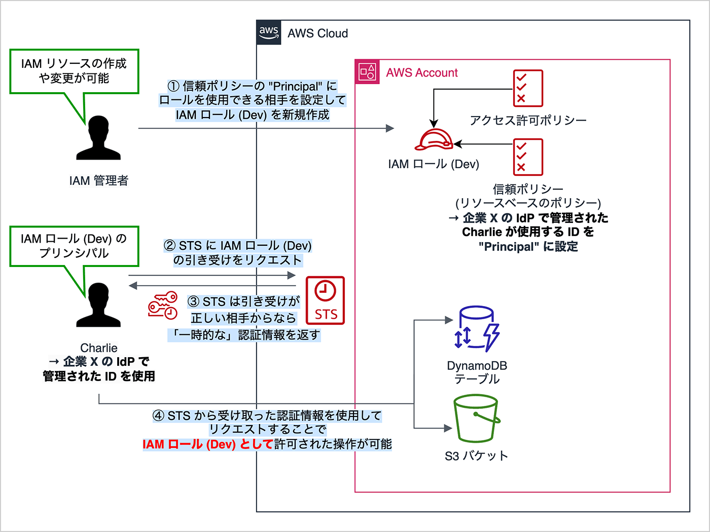
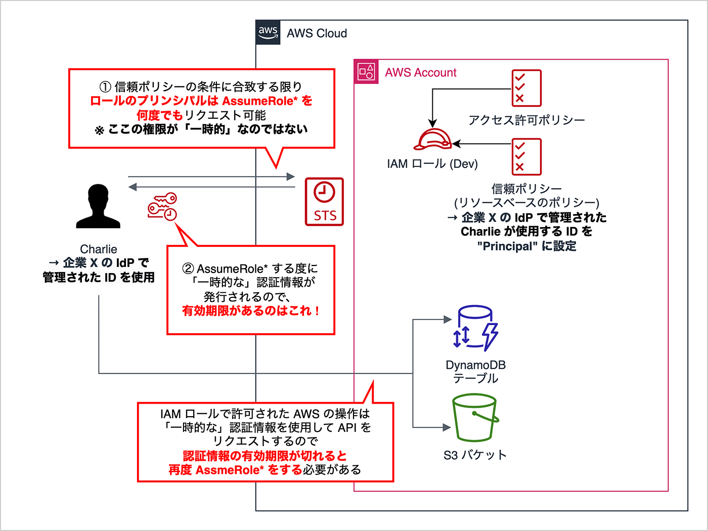

# IAM  
AWS Identity and Access Management  

何も知らない人におすすめ↓  
[IAM Roleについて(公式)](https://aws.amazon.com/jp/builders-flash/202303/learn-iam-role/)  

- AWSを使用するには、最初にAWSアカウント作成をする
- 作成後指定したメールアドレスとパスワードでログインすると、「ルートユーザー」としてAWSサービスを操作できる
- 「ルートユーザー」は基本的に何でもできるので、通常操作では使用しない
- その為、メンバー毎にIAM ユーザーやロールを使用する

※IAM ユーザーは作成せずに、IAM ロールを使用することが推奨されている  


### IAM ユーザーとIAM ロールの違い

1. IAM ユーザーの認証情報は「長期的（永続的）な」認証情報と呼ばれる
  IAM ユーザーを発行すると、明示的に向こうにしたりしない限り、そのまま使い続けることができる  
  IAM ロールは必ず有効期限がある認証情報を使用することになる
  
2. IAM ユーザーは特定の1人もしくは1つのアプリケーションに関連付けられる
  IAM ロールは1つの IAM ロールを複数の人やアプリケーションで使用することもある

- IAM ユーザーはユーザーの数分、用意することになるため、管理リスク（漏洩）が増える
- IAM ロールはAWS上で管理された長期的な認証情報（ID，パスワード）が1つあれば複数のIAMロールを使い分けたりできる  
  →シングルサインオン（SSO）と呼ばれる仕組み  


### IAM ロールの認証情報と発行の仕組み

1. IAM管理者が、信頼ポリシーの”Principal”にロ＾るを使用できる相手を設定して、IAMロールを新規作成
2. STSにIAMロールの引き受けをリクエスト
3. STSは引き受けが正しい相手からなら「一時的な」認証情報を返す
4. STSから受け取った認証情報を使用してリクエストすることで、IAMロールとして許可された操作が可能

 

IAM ロールには「信頼ポリシー」というリソースベースポリシーが必要で、信頼ポリシーの”Principal”要素にこのIAM ロールを誰が使用するかを定義します  
```JSON
{
    "Version": "2012-10-17",
    "Statement": [
        {
            "Effect": "Allow",
            "Principal": {
                "Service": "lambda.amazonaws.com"
            },
            "Action": "sts:AssumeRole"
        }
    ]
}
```

このロールを使用するサービス（EC2インスタンスやIAMユーザー、上記の場合だとLambda）は、IAMロールの認証情報をは行できるようになる  
そうするために、STS（Security Token Service）へAPIをリクエストして認証情報を受け取る  
認証情報を受け取る＝Actionの"AssumeRole"  


## IAM ロールの認証情報の「一時的」とは

IAMロールの認証情報の「一時的」とは「発行した認証情報自体」を指すので、IAMロールを使用してAWSを操作できる期間が一時的という意味ではない。  

 

STSから受け取った認証情報が一時的なものになる  


## いつ誰が認証情報を発行しているのか

認証情報が一時的なものはであるが、再発行はいつしているのか  
→AWSサービスやリソースでIAMロールを使用する場合は、AWS側で定期的に認証情報の発行をしてくれている  

---
ここまでが、[IAM Roleについて(公式)](https://aws.amazon.com/jp/builders-flash/202303/learn-iam-role/)からの情報  


## 信頼ポリシーのPrincipalで定義できるもの

[公式サイト](https://docs.aws.amazon.com/ja_jp/IAM/latest/UserGuide/reference_policies_elements_principal.html)  

- AWSアカウント
  ```JSON
  "Principal": {
    "AWS": "arn:aws:iam::123456789012:root"
  }
  ```
- IAMユーザー
  ```JSON
  "Principal": {
    "AWS": "arn:aws:iam::123456789012:user/UserName"
  }
  ```
- IAMロール
  ```JSON
  "Principal": {
    "AWS": "arn:aws:iam::123456789012:role/RoleName"
  }
  ```
- ロールセッション
  ```JSON
  "Principal": {
    "AWS": "arn:aws:sts::123456789012:assumed-role/RoleName/RoleSessionName"
  }
  ``` 
- IAMフェデレーティッドユーザー
  ```JSON
  "Principal": {
    "AWS": "cognito-identity.amazonaws.com"
  }
  ```
- AWSサービス
  ```JSON
  "Principal": {
    "AWS": "ec2.amazonaws.com"
  }
  ```
- すべてのプリンシパル
  ```JSON
  "Principal": {
    "AWS": "*"
  }
  ```
