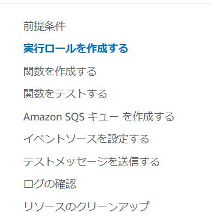

# SQSとLambdaの連携  

以下の公式チュートリアルに従い、サービスを構築していく  
https://docs.aws.amazon.com/ja_jp/lambda/latest/dg/with-sqs-example.html#with-sqs-prepare  

SQS→Lambda→CloudWatch Logsの流れを構築する  

1. CloudWatch Logs にメッセージを書き込む Lambda 関数を作成します。  
2. Amazon SQS キューを作成します。  
3. Lambda イベントソースマッピングを作成します。イベントソースマッピングは Amazon SQS キューを読み取り、新しいメッセージが追加されたときに Lambda 関数を呼び出します。  
4. キューにメッセージを追加して設定をテストし、CloudWatch Logs で結果をモニタリングします。  

詳細↓ (※前提条件はOK)  
  

### 実行ロールの作成  

LambdaがSQSからの項目を読み取れるように「AWSLambdaSQSQueueExecutionRole」というポリシーをアタッチする  
作成手順はチュートリアル通り（特に問題なし）  

lambda-sqs-roleというロールを作成  


### 関数の作成  

LambdaでのSQSイベント消費のスクリプトは[こちら](./sqs-tutorial/index.js)  

AWSのCloudShellでファイル作成→圧縮→LambdaCreateを行う  
LambdaCreate時には作成したロールをARNで指定する  
```shell
aws lambda create-function --function-name ProcessSQSRecord \
--zip-file fileb://function.zip --handler index.handler --runtime nodejs18.x \
--role arn:aws:iam::111122223333:role/lambda-sqs-role
```


### 関数をテストする  

テストで使用する[JSON](./sqs-tutorial/input.json)  

以下のコマンドを実行すると、Lambdaを実行できる  
```shell
aws lambda invoke --function-name ProcessSQSRecord --payload file://input.json out --log-type Tail \
--query 'LogResult' --output text --cli-binary-format raw-in-base64-out | base64 --decode
```
AWS CLIのlambda Invokeのパラメータ詳細は[こちら](https://docs.aws.amazon.com/cli/latest/reference/lambda/invoke.html)  


### Amazon SQS キューの作成  

MyQueという名前で作成  
（他のオプションは全部デフォルト）  


### イベントソースを設定する（LambdaとSQSの結びつけ）  

以下のコマンドで行う  
```
aws lambda create-event-source-mapping --function-name ProcessSQSRecord  --batch-size 10 \
--event-source-arn arn:aws:sqs:us-east-1:111122223333:my-queue
```


### テストメッセージを送る  

チュートリアル通り、コンソールからテストメッセージを送る  
Lambdaから実行履歴を見れば、うまく実行されていることがわかる  

