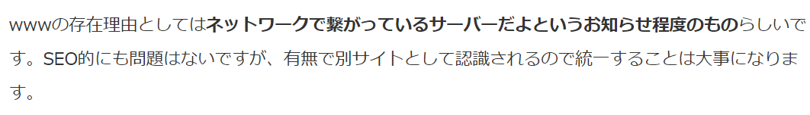
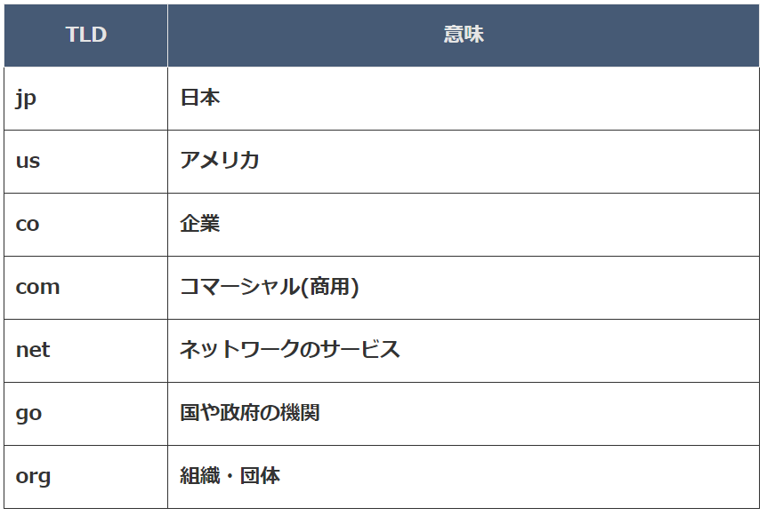
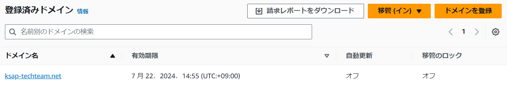
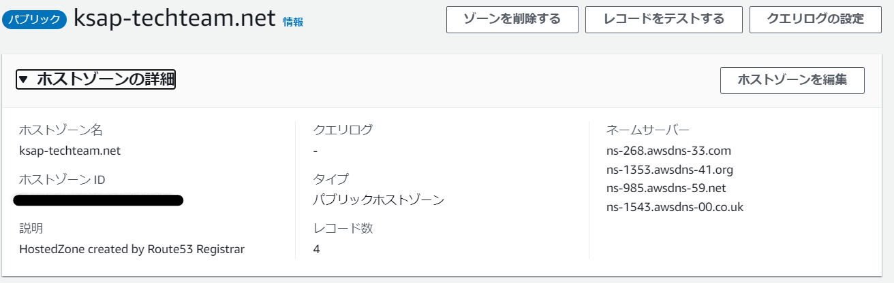
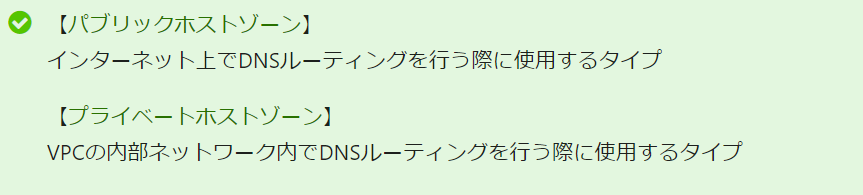
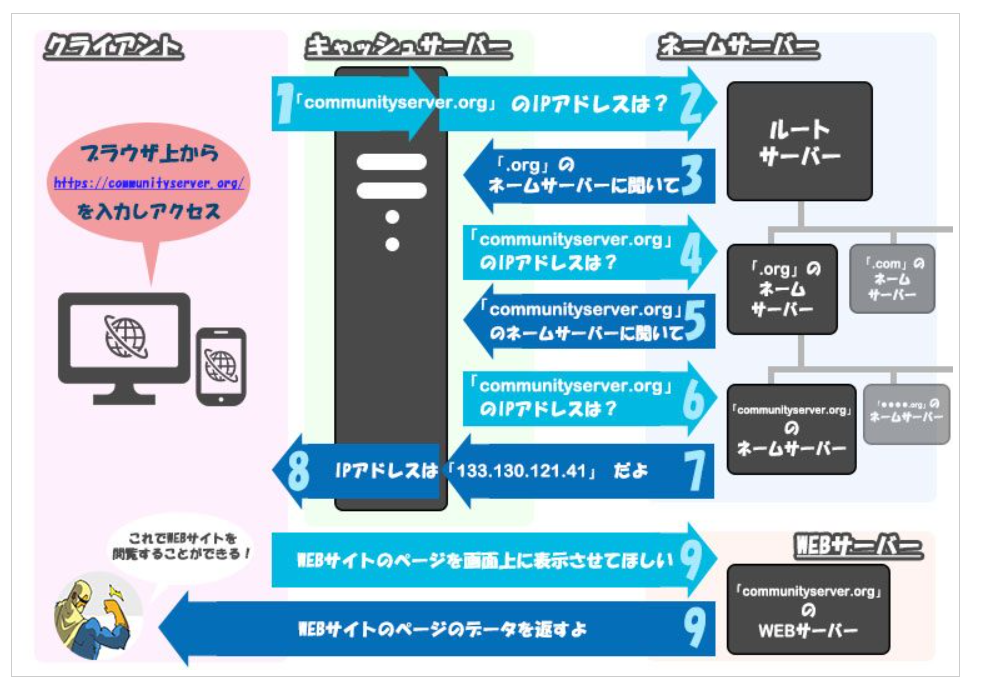

# Route53について  

### Route53とは  

```
Amazon Route 53 は、可用性と拡張性に優れたドメインネームシステム (DNS) ウェブサービスです。Route 53 を使用すると、ドメイン登録、DNS ルーティング、ヘルスチェックの 3 つの主要な機能を任意の組み合わせで実行できます。
```

### PJで使われる用語  

- レコード(セット)  
- API Gatewayのパスとの結びつけ  
- ホストゾーン  
- 環境ごとのアクセス先はサブドメインで表現  


基本から整理  
### ドメイン・サブドメイン  

例えばHTTPS://www.kaguya.comというURLがあったときにホストとドメインは以下のようになる    
ホスト(サブドメイン)：www  
ドメイン：kaguya.com  

ホストはあってもなくてもいいもの（ほんとかは不明）  
  

ドメイン  
→他とかぶってはいけない  

- トップレベルドメイン（TLD）  
.comの部分をトップレベルドメインという  
TLDはあらかじめ取得できるものが決まっている  
  

AWSがサポートしているTLDはたくさんあった  
https://docs.aws.amazon.com/ja_jp/Route53/latest/DeveloperGuide/registrar-tld-list.html

### ホストゾーン  

以前作成したものを参考に見ていく。  

作成したドメイン：ksap-techteam.net  
登録済みドメインとして登録されていている  
(TLDをnetにした理由は、安かったからっだったはず)  
  

ホストゾーンは、ドメインを作成したときに同じ名前で作成される  
  

- パブリックホストゾーン  
  インターネット上でのDNSルーティングの際に使用するタイプ  
    

- ネームサーバー  
  ドメインとIPアドレスを変換してくれるサーバー  
  


- レコードセット  
  ルーティング情報のこと  
  exzample.comとIPv4アドレスのルーティングの場合、AタイプのDNSレコードを使用する  

  


