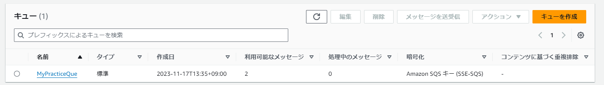

# SQSを触ってみた  

以下のサイトを参考にSQSを触ってみる  
https://qiita.com/nobkovskii/items/7cac96ec261fb8dc50d5  

### キューの作成  

ポータル画面からキューの作成を行っていく  
※リージョンは東京を選択  
タイプは一旦そのまま  
名前は任意  
  

設定項目はデフォルトのまま  
  

暗号化もそのまま  
  

アクセスポリシーもそのまま  
  

許可もポリシーの再実行・デッドレターキューもそのまま  
  


### メッセージ登録スクリプトの作成  

AWS CloudShellからメッセージを送るためのスクリプト作成  

- CloudShellはポータル画面の右上から起動可能  
- デフォルトでnanoやSDKが入っているの準備等は必要ない  

```js
const AWS = require("aws-sdk")
// 利用するリージョンを指定する
const SQS = new AWS.SQS({ region: "ap-northeast-1" })

// アカウントIDとキューの名前は各人の値を設定してください
const QueueUrl = "https://sqs.ap-northeast-1.amazonaws.com/123456789012/my_queue"

async function sendMessage(message) {
  try {
    const MessageBody = JSON.stringify({ message })
    const result = await SQS.sendMessage({ MessageBody, QueueUrl }).promise()
    console.log(result)
  } catch (e) {
    console.error(e)
  }
}

sendMessage("こんにちは")
```

スクリプト実行(nodeもデフォルトで入っている)  
```
node ファイル名.js
```
ファイルを実行するごとに「利用可能メッセージ」が増えている  
  


### メッセージ取得スクリプトを作成する  

```js
const AWS = require("aws-sdk")
const SQS = new AWS.SQS({ region: "ap-northeast-1" })

const QueueUrl = "https://sqs.ap-northeast-1.amazonaws.com/123456789012/my_queue"

async function processingMessage() {
  try {
    const params = {
      QueueUrl,
      MaxNumberOfMessages: 10, // 最大取得メッセージ
      WaitTimeSeconds: 20 // ロングポーリング
    }
    const messages = await SQS.receiveMessage(params).promise() // メッセージを取得
    for (message of messages.Messages) {
      const body = JSON.parse(message.Body)
      console.log(message)
      console.log(body.message) //メッセージの実態
      //重い処理
      await new Promise((resolve, reject) => {
        setTimeout(resolve, 1000)
      })
      const params =  {
        QueueUrl,
        ReceiptHandle: message.ReceiptHandle
      }
      // キューの削除箇所を、あえてコメントアウト
      // const deleteResult = await SQS.deleteMessage(params).promise()
      // console.log(deleteResult)
    }

  } catch (e) {
    console.error(e)
  }
}

processingMessage()

```

実行すると、先ほど入れたデータが帰ってくる  
  

データ削除処理は入れていないので、キューのデータは削除されない  

### ドキュメント情報  
SQSをjavascriptで動かすときのドキュメント情報は以下を参照  
[各種メソッド情報](https://docs.aws.amazon.com/AWSJavaScriptSDK/latest/AWS/SQS.html)  
[コード例](https://docs.aws.amazon.com/ja_jp/sdk-for-javascript/v3/developer-guide/javascript_sqs_code_examples.html)  
[コード例2](https://docs.aws.amazon.com/sdk-for-javascript/v2/developer-guide/sqs-examples.html)  
