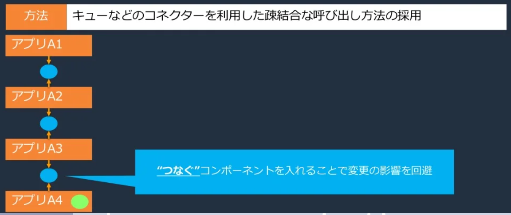
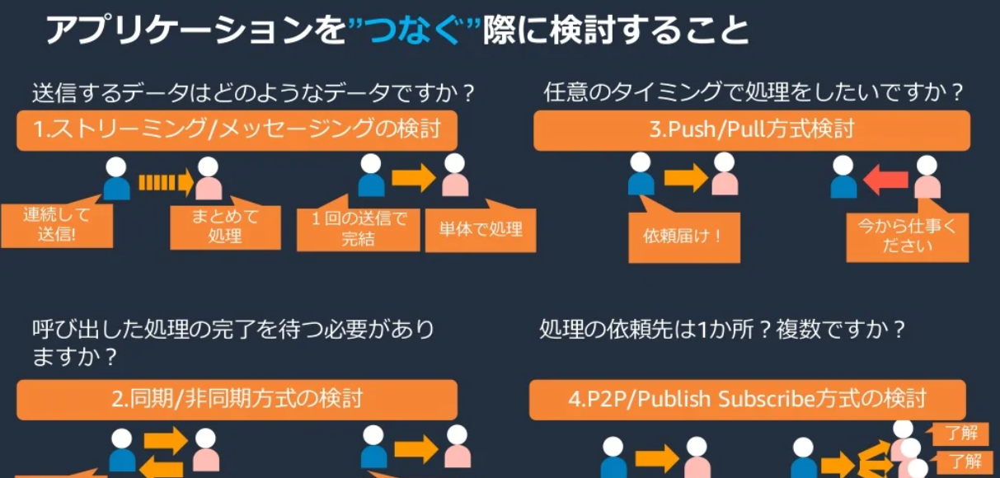
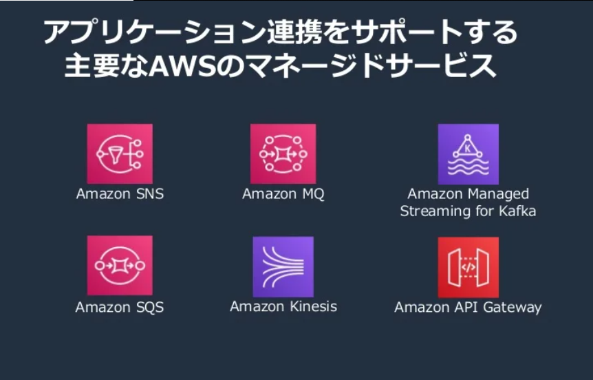
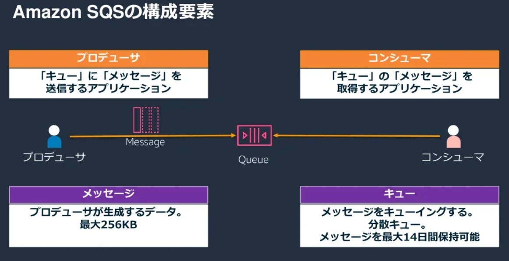
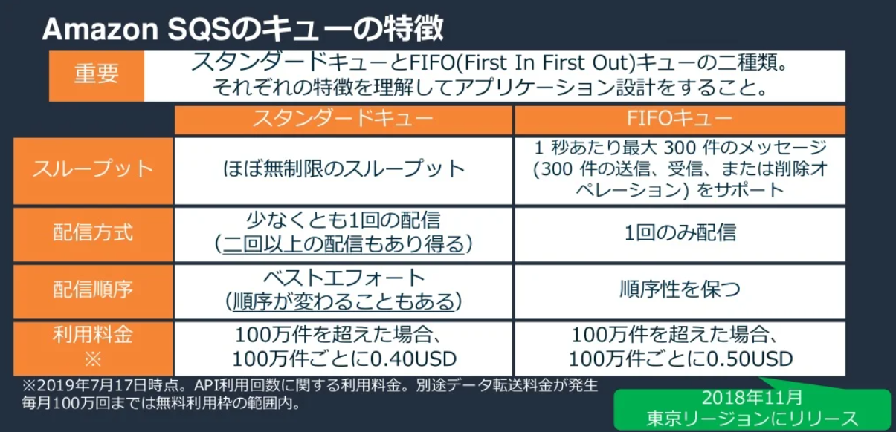

# SQS  

blackbeltの記事から  
実際に触ってみた時の話は[こちら]()

### なぜSQSが必要なの  

アプリケーションアーキテクチャの観点では、柔軟性が求められる。  

#### 柔軟性  

- 影響範囲の把握・限定はしやすいか  
- 開発・テストはしやすいか  
- リリースはしやすいか  
- 万が一失敗したときの影響は小さいか  

#### 柔軟性の具体例  

影響範囲  
100機能あるアプリケーションを4つに分解し、1アプリ25機能ずつに分けたとき  
100機能アプリと分割したアプリだと、影響範囲が小さくなるのは後者である。  

#### コンポーネント間の結合度を弱める  

  

→コンポーネントをつなぐアプリの１つとして、SQSがある  

### コンポーネントをつなぐ際の検討事項  

アプリケーションをつなぐ際に検討すること（4つ）  
  1. 送信するデータにはどのようなものがあるか  
     ストリーミング / メッセージング  
     データの連続送信 / 1回でまとめて送信    
  2. 処理を行うタイミング  
     Push / Pull  
     メッセージは任意のタイミングで送信、受け取り側は常時受け取り / 受け取り側からの要求があれば送信  
  3. 同期・非同期  
     呼び出した処理の完了を待つ必要があるかないか  
  4. 処理の依頼先は１か所 or 複数  
     P2P / Publish Subscribe  
     1対1通信 / 送り手1対受け取り多通信  
       

### アプリケーション連携をサポートする主要なAWSのマネージドサービス  
大事かも  
  

 コンポーネントをつなぐ際の剣道事項より、SQSを使う条件は  
  1. 送信するデータにはどのようなものがあるか  
     →メッセージデータ  
  2. 処理を行うタイミング  
     →Pull  
  3. 同期・非同期  
     →非同期  
  4. 処理の依頼先は１か所 or 複数  
     →P2P（1対1）  

### SQSの構成要素  

- キュー  
  送信者と受信者の間にあるもの  
  キューイング機能  
  メッセージを最大14日保持可能  
- メッセージ  
  送り手が送信（生成）するデータ  
  最大256KB  
- プロデューサー  
  データ送り手  
  キューにメッセージを送信するアプリケーション  
- コンシューマ  
  受け取り手  
  キューのメッセージを取得するアプリケーション  
    

### SQSの利用ケース  

- 大量リクエストは一時的に発生する場合にキューで受ける  
- アプリケーション間の依存関係を弱めたい場合  
- 重い処理が含まれていても素早く応答をしたい場合  
- 複数の処理を並行処理したい場合  

### SQSの特徴  
  

