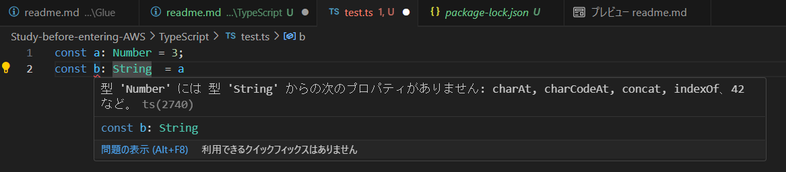

# Typescript

Javascriptに「型付き（Type）」を足したもの  
静的型付き言語  


- Javascript
    ```js
    var list = [];
    let suuzi = 1;
    const name = "プログラミング";
    ```
    Javascriptには「型」がない  
    変数に値を入れるまで、文字列なのか数値なのか配列なのかがわからない  

- Typescript
    ```js
    var list: Striog[] = [];
    let suuzi: Number = 1;
    const name: String = "プログラミング";
    ```
    Typescriptでは「型」を宣言する  


Javascript：緩いルール  
Typescript：厳格なルール  

Typescriptのままでは実行できないため、結局はJavascriptにコンパイルしないといけない  

「型」を指定することで
- コンパイル時にエラーチェックできる  
- 可動性が上がる
- プログラムの処理速度が上がる  
  →余分なメモリを使わなくなる  

## Typescriptを書いてみよう

nodeが必要  
```shell
> node -v
v20.5.0
```
Typescriptをインストールするためのpackage.json
```shell
> npm init -y
{
  "name": "typescript",
  "version": "1.0.0",
  "description": "Javascriptに「型付き（Type）」を足したもの  \r 静的型付き言語",
  "main": "index.js",
  "scripts": {
    "test": "echo \"Error: no test specified\" && exit 1"
  },
  "keywords": [],
  "author": "",
  "license": "ISC"
}
```
Typescriptをインストール
```shell
npm i --save-dev typescript
```
package.jsonに以下が追記される  
```json
"devDependencies": {
    "typescript": "^5.5.4"
  }
```
node_moduleもインストールされている  
node_module > .bin > tcs　これがあることでtscコマンドが使えるようになる  

tscのバージョン確認
```shell
> npx tsc -v
Version 5.5.4
```

拡張子はtsでtestファイルを作成  
簡単な変数宣言を書いてみる  

型が違う変数を入れようとすると、以下のようなエラーになる  


コンパイルは以下のコマンド
```shell
> npx tsc test.ts
→test.jsがコンパイルされる
```
