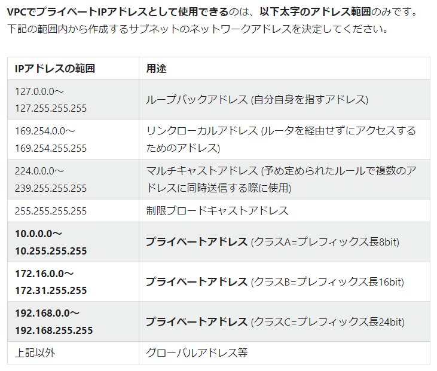
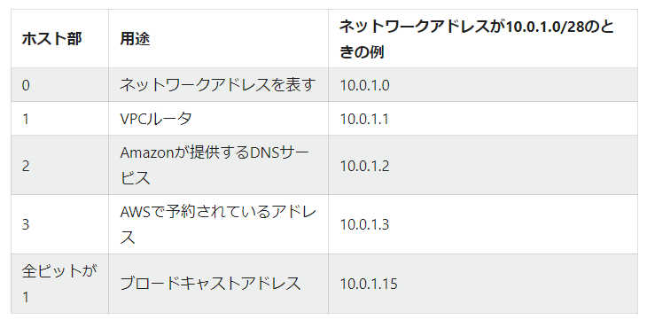

# AWS VPC  

※既に習得済みの部分は省略する  

### 使用可能なIPアドレス  

IPアドレスの指定にはICANNという組織がルールを定めており、用途に応じで使用できる  
アドレス範囲が決まっている。  
  
また、IPアドレスのホスト部はAWSで利用されているため使用できない。  
  

### NAT・NAPT  

グローバルIPアドレスとプライベートIPアドレスの変更する機構  
NAPTはNATの機能に加え、ポートも対象とすることで、1つのグローバルIPアドレスも変換対象とする機構のこと  

### ルーティング  

サブネット同士の通信経路を決定する制御  
自サブネット以外との通信にはルーティングが必要である。  

ルーティングテーブルの見方？  
https://qiita.com/c60evaporator/items/2f24d4796202e8b06a77#%E3%83%AB%E3%83%BC%E3%83%86%E3%82%A3%E3%83%B3%E3%82%B0%E3%83%86%E3%83%BC%E3%83%96%E3%83%AB%E3%81%AE%E8%A6%8B%E6%96%B9

### 外向き通信と内向き通信  

外向き：内部ネットワーク（VPC等）からインターネット方向への通信  
内向き：インターネットから内部ネットワーク方向への通信  

インターネットで最も一般的に使用されるTCP通信では
基本的に片方向のみでの通信が完結することはない。  

双方向通信を扱う際に2種類の考え方がある  
ステートレス：パケットが要求・応答に関わらず通信の方向のみで外向きか内向きかを判定する方法  
ステートフル：通信の起点となる要求パケットの方向が外向きなら、それに付随する応答パケットも全て外向きとして扱う方法  
↓  
ステートフルは最初の要求パケットの方向のみを気にすればいいので、ファイアーウォールの設定をシンプルにできる。  
そのため、多くのファイアーウォールではステートフルな設定を採用している  

### ファイアーウォールとACL  

サブネット単位でIPアドレスやポート番号に基づき、アクセス制限を設定する機能  

