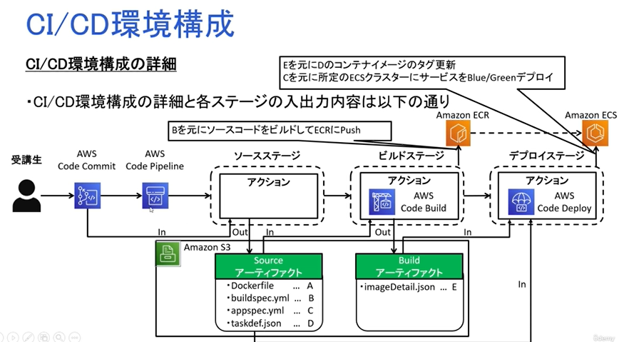

# CI/CD構築ハンズオン  

リポジトリへのソースコードのコミットをトリガーに、ビルド、デプロイが自動実行され  
コンテナにソースの修正内容が反映されていることを確認する  

1. ソースコードをpush  
2. Codepipelineが変更を検知し、CI/CDパイプラインをスタート  
3. CodeBuildがDockerイメージをビルドし、ECRにpush  
4. CodeDeployがECRのDockerイメージをECSクラスターにデプロイ  

全体図
  

1. CodeCommitリポジトリ作成  
2. S3にソース用意  
3. CodeBuild、CodeDeploy用のIAMロール作成  
4. Blue/Greenデプロイ用サービス作成  


### CodeCommitリポジトリ作成  

ポータル画面からCodeCommimtへ移動  
- 設定項目は名前だけ ctn-cicd-hdon-coderep  

### git環境の構築  

Cloud9上で行っていく  
AWSの認証ヘルパー機能を使うことで、gitへのアクセス時に認証を毎回行わないで済む  

- 認証ヘルパーを利用できるようにする  
  Cloud9のcliで以下のコマンドを実行する  
  git config --global credential.helper '!aws codecommit credential-helper $@'  
  git config --global credential.UseHttpPath true  

  個人名設定  
  git config --global user.name "xxx" # ご自身のお名前を設定ください  
  git config --global user.email "xxx" # ご自身のEメールアドレスを設定ください  

  リポジトリのクローン  
  git clone xxx # CodeCommit 画g面からコピーしてください  


### ビルド定義・デプロイ定義・タスク定義の作成  

- ビルド定義ファイル(buildspec.yml)  

```yaml
## 大きく3つに処理が分かれている
version: 0.2
phases:
  #ECRリポジトリへのログインを行う
  pre_build:
    commands:
      - $(aws ecr get-login --region $AWS_DEFAULT_REGION --no-include-email)
      - REPOSITORY_URI=各自ご自身のURIに置き換えてください！
      - IMAGE_TAG=$(echo $CODEBUILD_RESOLVED_SOURCE_VERSION | cut -c 1-7)
  #biuldを実施する箇所
  build:
    commands:
      - docker build -t $REPOSITORY_URI:latest .
      - docker tag $REPOSITORY_URI:latest $REPOSITORY_URI:$IMAGE_TAG
  #イメージをECRにPUSH
  post_build:
    commands:
      - docker push $REPOSITORY_URI:latest
      - docker push $REPOSITORY_URI:$IMAGE_TAG
      - printf '{"Version":"1.0","ImageURI":"%s"}' $REPOSITORY_URI:$IMAGE_TAG > imageDetail.json
#imageDetail.jsonの出力を行う
# imageのURIがビルドの度にリビジョンが付与されて更新される
# 後続のCodeDeployでURIを参照するためにファイル出力を行っている
artifacts:
    files: imageDetail.json
```

- デプロイ定義（appspec.yml）  

CodeDeployが使用するファイル  
```yaml
version: 0.0
Resources:
  - TargetService:
      Type: AWS::ECS::Service
      Properties:
        TaskDefinition: "<TASK_DEFINITION>"
        LoadBalancerInfo:
            ContainerName: "各自ご自身のコンテナ名に置き換えてください！"
            ContainerPort: "80"
```

- タスク定義ファイル

ポータル画面から、タスク定義のJSONを取得  
imageのURIを<IMAGE1_NAME>と置き換えることで、CodeBuildの際に動的なタグ付与を行うことができる  


### CodeBuild、CodeDeploy用のIAMサービスロールの作成  

CodeDeploy用のロールの作成  
- IAMからロールの作成を行う  
  - エンティティはそのまま  
  - ユースケースはCodeDeploy - ECS  
  - AWSCodeDeployRoleForECS,AmazonS3FullAccessというポリシーを追加する  
  - ServiceRoleForCodeDeployというロール名で作成する  


### Blue・Creenデプロイ用サービスの作成  

サービスに紐づけるロードバランサを作成するための事前準備として  
LBの接続制御を行うセキュリティグループを作成  

- セキュリティグループの作成  
  - 名前はctn-cicd-hdon-albForCicdで作成  
  - VPCはECSで作ったもの（ctn-cicd-hdon-vpc）  
  - インバウンドルールではHTTP(80ポート)とカスタムTCP(8080ポート)のIPv4全てを許可する用に設定  

- ロードバランサの作成  
  - EC2のポータル画面に移動し、左メニューからロードバランサ作成を行う  
  - Application LBを選択  
  - 名前はctn-cicd-hdon-AlbForCicd  
  - スキームはインターネット向け  
  - ネットワークマッピングでVPCをctn-cicd-hdon-vpcにし、AZはどちらも選ぶ  
  - セキュリティグループも作ったものを選択  
  - ターゲットは適当に作成して選択しておく（後で消すから）  
  - 作成後、リスナーとターゲット(target)を削除  

- 新しいサービスの作成を行う  
  - ECSのクラスターを選択し、サービスの作成を押す  
  - ※長いので省略  
  - 疎通確認を行う  
  - EC2のロードバランサから、DNS名のコピーを行う  
  - 別ブラウザでDNSを検索すると、apacheが表示される  


### CodePipeline作成～ソースステージ編～  

- CodePipelineの作成を行う  
  - ポータル画面からCodePipelineへ移動し、作成を行う  
  - 名前はctn-cicd-hdon-pipelineで、その他はデフォルトのまま次へ  
  - ソースプロバイダーはCodeCommitを選択  
  - リポジトリは作成済みのctn-cicd-hdon-coderep、ブランチはmanster  
  - 検出オプションはCloudwatch Eventを選択、後はデフォルトで次へ  


### CodePipeline作成～ビルドステージ編～  

- 上の続きから  
  - プロバイダーでCodeBuildを選択  
  - プロジェクトの作成を行う  
  - プロジェクトの名前はbtn-cicd-hdon-build  
  - OSはUbuntuを選択、ランタイムはStandard、イメージは最新のものを選択  
  - 特権付与にもチェックを入れる、後はデフォルトのまま   


### CodePipeline作成～デプロイステージ編～  

- 上の続きから  
  - プロバイダーでAmazon ECS（ブルー/グリーン）を選択  
  - AWS CodeDeploy アプリケーション、デプロイグループは自動で作成されているものを選択（末尾がservForCicd）  
  - ECSのタスク定義、CodeDeploy AppSpec ファイルはBuildArtifactを選択し次へ、そしてpipeineの作成を行う  
  - Buildで失敗する  
    ビルドステージではECRにビルド成果物をPUSHするのだが、CodeBuildがECRにPUSHするための許可がないといけない  
  - IAMへ移動し、CodeDeploy用の自動生成された	codebuild-btn-cicd-hdon-build-service-roleを選択  
  - AmazonEC2ContainerRegistryPowerUserというポリシーをアタッチする  
  - DeployStageの修正も必要  
  - Pipelineを選択して、編集をクリック  
  - Deployステージの左ボックスの編集を押す  
  - 入力アーティファクトでソースアーティファクトも追加する  
  - ECSのタスク定義とAppSpecファイルはソースアーティファクトを参照するように変更  
  - 入力アーティファクトを持つイメージの詳細はBuildアーティファクトを選択  
  - タスク定義のプレースホルダー文字にIMAGE1_NAMEを入れる  
  - 変更を保存  
  - 左メニューのデプロイ＞アプリケーション＞語尾がservForCicdのものを選択＞デプロイグループの選択  
    デプロイ設定のトラフィックの再ルーティングの設定で、再ルーティングの時間と元リビジョンの終了時間を１０分に変更  
  
  Buildステージに環境変数の追加をする  
  - パイプラインの画面からBuildの編集を行い、以下の環境変数を追加する  
    AWS_DEFAULT_REGION: ap-northeast-1(テキストプレーンでOK)  
  

### CICDの初回実行  

- 編集したパイプラインの実行  
  - 変更をリリースするボタンで実行できる  
  - またBuildでエラーが出る  
    Buildの定義ファイルに一部アップデートが必要  
    buildspec.ymlの５行目にあるaws ecr get-login --region $AWS_DEFAULT_REGION --no-include-emailが古いのが原因(エラー内容にもそう出てる)  
    →aws ecr get-login-password --region ap-northeast-1 | docker login --username AWS --password-stdin 941920968752.dkr.ecr.ap-northeast-1.amazonaws.com.dkr.ecr.ap-northeast-1.amazonaws.com  
  - リポジトリフォルダにsrcフォルダも追加する  
  - gitにpushする（pipelineは自動で実行される）  
  - （ロールの作成に時間がかかっている）  

  