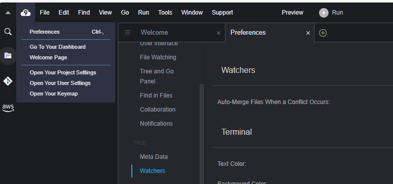
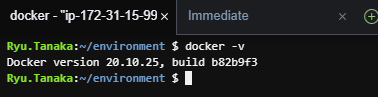
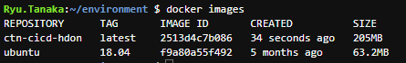
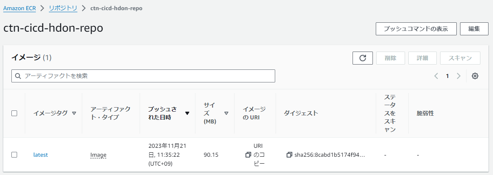

# AWSでコンテナ構築  

- 実施内容その1  
```
Cloud9でコンテナイメージを作成し、ECRへイメージをPUSH  
その他、ECS,Fargateで複数コンテナを起動してみる  
```
- 実施内容その2  
```
1つのコンテナを削除したとき、１つのコンテナが立ち上がるのかという
オーケストレーション機能を試す
```
- 実施内容その3  
```
設定値を変更して、コンテナの数を変更する
```

### Cloud9の環境構築  

リージョンは基本東京を使う  

ポータル画面からCloud9の画面に移動し、環境の作成を行う  
- 名前  
  今回は、ctn-cicd-hdon-tanakaとする  
- 新しいEC2インスタンスに作成  
  インスタンスのスペックはメモリは２Gほしいとのこと  
  OSはAmazonLinux2  
- ネットワーク設定はそのまま  

作成したら、Cloud9を開く  
※左上のCloud9のまーくから文字フォントなどの細かい設定ができる  
  

Cloud9の環境にはデフォルトでDockerが入っている  
  

### コンテナイメージの作成  

1. Dockerfileの作成  
2. docker buildコマンド実行  
3. イメージ作成(今回はカスタムイメージ)  

- DockerFileの作成  

以下の内容でDockerfileを作成する  
（##のコメントに各コマンドの機能説明を追加している）
```shell
## イメージの指定
FROM ubuntu:18.04

# Install dependencies
## RUNコマンドはFROMで指定したイメージに対してコマンドを実行する
## ↓ appachをインストール
RUN apt-get update && \
 apt-get -y install apache2

# Copy html file to apach directory
## ローカルのファイルをコピー（src→/var/www/html/）
COPY src/ /var/www/html/

# Configure apache
##　appachを動作させるためのコマンド
RUN echo '. /etc/apache2/envvars' > /root/run_apache.sh && \
 echo 'mkdir -p /var/run/apache2' >> /root/run_apache.sh && \
 echo 'mkdir -p /var/lock/apache2' >> /root/run_apache.sh && \ 
 echo '/usr/sbin/apache2 -D FOREGROUND' >> /root/run_apache.sh && \ 
 chmod 755 /root/run_apache.sh

## コンテナに対して80ポートを許可する
EXPOSE 80

## コンテナ起動時に実行するファイルを指定
CMD /root/run_apache.sh
```

- srcフォルダを作成し、index.htmlをおく  
  htmlファイルにはノンブレークスペースという通常の空白とは異なる特殊な空白が入ることがあるので、以下のコマンドで削除しておく  
  sed -i "s/$(echo -ne '\u200b')//g" Dockerfile  

- buildの実行  
  docker build -t ctn-cicd-hdon  

- イメージの確認  
  Ubuntuのイメージを指定したので、ダウンロードされている  
    

- 実行中のコンテナ確認コマンド  
  docker ps  

- コンテナ実行  
  docker run -d -p 8080:80 --name local-run ctn-cicd-hdon  

  - -p 8080:80  
    Cloud9のLinux環境の8080ポートをコンテナ側の80ポートと接続する  
    Cloud9の画面上から動かしているコンテナにアクセスできる  
  - -d  
    バックグランドでの実行という意味
  - --name  
    イメージに対するコンテナ名を指定  

- コンテナへのアクセスはcurlコマンドで行う  
  curl localhost:8080  


### コンテナ環境へのリモートログイン  

- コンテナへのログイン  
  docker exec -i -t local-run bash  

### コンテナイメージをECRに登録  

ポータル画面でECRの画面へいき、左のツリーからリポジトリを選択し、作成を行っていく  

- リポジトリ名はctn-cicd-hdon-repo  
- その他はデフォルトのまま  
- 作成後、URIを使うので取っておく  

もう一度、イメージを作成  

- buildコマンド  
  docker build -t [ここでリポジトリのURIを貼り付け]:latest .  
  作成したイメージをECRにpushする  

- ECRにアップするためにはdocker loginコマンドでログインを行う必要がある  
  aws ecr get-login-password | docker login --username AWS --password-stdin 941920968752.dkr.ecr.ap-northeast-1.amazonaws.com  

  --password-stdin部分は、先ほどコピーしたECRのURIのスラッシュ手前の部分  

- pushを行う  
  docker push 941920968752.dkr.ecr.ap-northeast-1.amazonaws.com/ctn-cicd-hdon-repo  

  イメージがpushされる  
    


